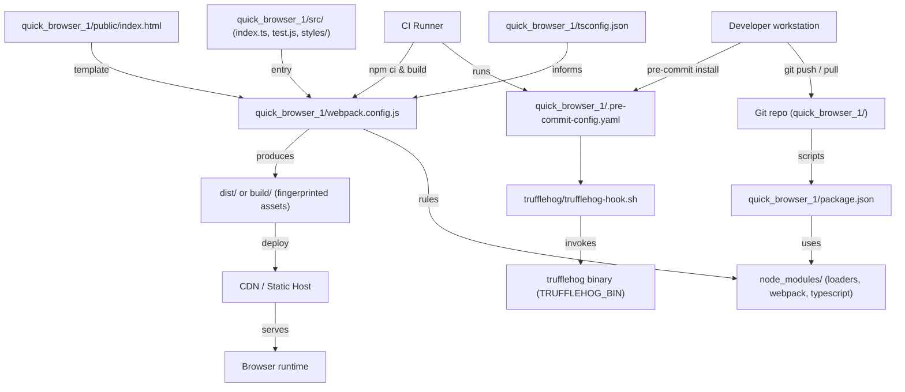
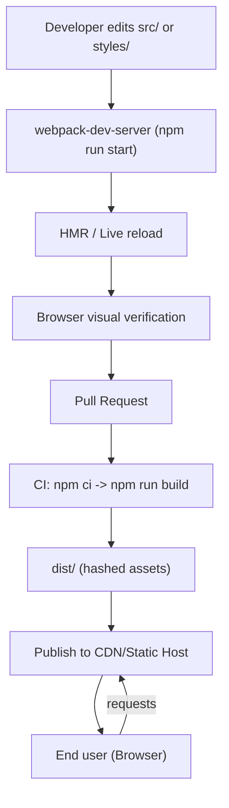
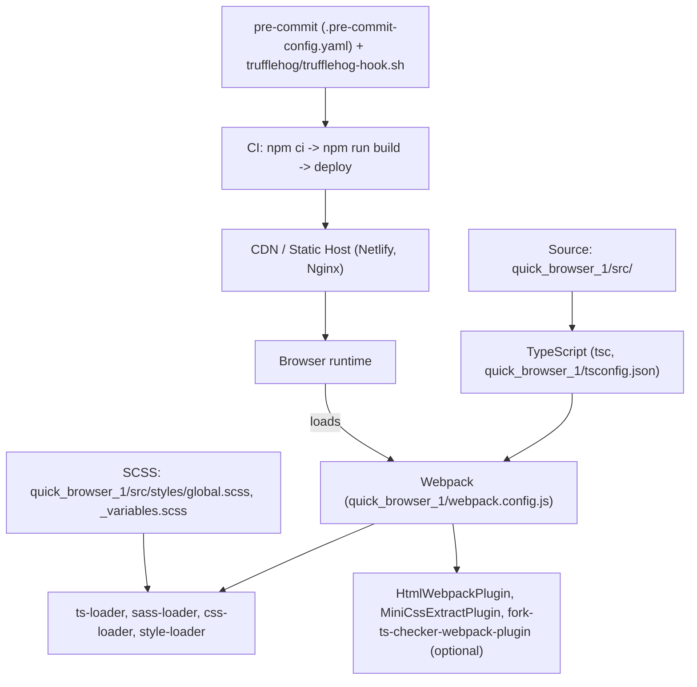

# quick_browser_1 - System Overview

## Frontend-Backend Topic Coordination Architecture
This repository is a frontend-focused application composed of TypeScript sources, SCSS-based styling, Webpack-based bundling, developer tooling (npm, pre-commit), and repository-level security checks. Primary topics and responsibilities:

- Build and Compilation — quick_browser_1/tsconfig.json, quick_browser_1/webpack.config.js, ts-loader, sass-loader, MiniCssExtractPlugin, HtmlWebpackPlugin, webpack-dev-server.
- Developer Tooling and Workflows — quick_browser_1/package.json scripts, package-lock.json, npm install/npm ci, deterministic CI builds, node_modules/.bin tool resolution.
- Frontend Application — quick_browser_1/src/index.ts, quick_browser_1/src/test.js, quick_browser_1/src/styles/global.scss, public/index.html, dist/build artifacts, SPA considerations.
- Security and Repository Hygiene — quick_browser_1/.pre-commit-config.yaml, trufflehog/trufflehog-hook.sh, pre-commit, CI pre-commit enforcement, TRUFFLEHOG_BIN.
- Styling and Visual Design — quick_browser_1/src/styles/global.scss, _variables.scss (token migration), component-scoped styles under src/components.

These topics work together to produce a predictable developer loop (local dev server + HMR), CI-driven production builds (tsc + webpack, hashed assets), and repository-level enforcement (pre-commit/trufflehog) to prevent secrets from entering history.

## Key Application Flows
1. Development Loop: edit → hot-reload
   - Developer runs: npm install; npm run start (webpack serve).
   - webpack-dev-server uses quick_browser_1/webpack.config.js to resolve entry ./src/index.ts.
   - ts-loader transpiles .ts according to quick_browser_1/tsconfig.json; sass-loader -> css-loader -> style-loader processes SCSS imports (e.g., src/styles/global.scss).
   - HtmlWebpackPlugin injects bundles into public/index.html; dev server serves in-memory assets and applies HMR/live reload so the browser reflects edits immediately.

2. CI Production Build and Publish
   - CI job checks out repository, runs npm ci (using package-lock.json), then runs npm run build.
   - tsc -p quick_browser_1/tsconfig.json emits JS/.d.ts into ./build/ when configured; webpack (mode: "production") bundles assets, replaces style-loader with MiniCssExtractPlugin.loader to produce CSS files, and fingerprints assets.
   - CI publishes dist/ (or build/) to CDN/Static Host with cache-control for hashed assets and short TTL for index.html; SPA fallback (index.html) ensures client-side routing works.

3. Application Startup (runtime bootstrap)
   - Browser requests public/index.html; it references /assets/app.<hash>.js and /assets/styles.<hash>.css.
   - Browser loads JS bundle; index.ts executes import './styles/global.scss' (side-effect), imports default export foo from src/test.js, and invokes foo('hello world') — deterministic startup action observable via console.log.
   - Client router (if present) mounts to <div id="root">; optional service worker may register and cache assets.

4. Repository Hygiene and Secrets Enforcement
   - Developer installs pre-commit and runs pre-commit install; .git/hooks run trufflehog/trufflehog-hook.sh on commits and pushes.
   - CI runs pre-commit run --all-files (or explicit trufflehog) using a pinned trufflehog runtime (TRUFFLEHOG_BIN or vendored binary) to ensure parity with local checks. Failures block merges until secrets are removed and rotated.

5. Styling & Theming Change Flow
   - Developer edits quick_browser_1/src/styles/global.scss or creates/updates src/styles/_variables.scss.
   - SCSS pipeline compiles tokens and global baseline; component-specific styles override baseline through scoped files under src/components.
   - CI runs SCSS compilation and style checks during PR validation; visual verification via screenshots/tests recommended for baseline changes.

## Architectural Principles
1. Explicit Build Contracts
   - tsconfig.json (quick_browser_1/tsconfig.json) and webpack.config.js declare and align compilation and bundling semantics (module/target/outDir). Build steps (tsc, webpack) are explicit npm scripts to ensure reproducible artifacts.

2. Minimal Bootstrap & Deterministic Startup
   - index.ts contains minimal deterministic startup behavior (import global styles, invoke foo from src/test.js). Side-effects are explicit and easily testable/mocked to keep CI fast and tests reliable.

3. Layered Tooling Separation
   - Clear separation between compilation (tsc), bundling (webpack + loaders/plugins), runtime assets (dist/build), and repository hygiene (pre-commit/trufflehog). Each layer has its own configuration file that is referenced by tooling: tsconfig.json, webpack.config.js, .pre-commit-config.yaml.

4. Developer-First Fast Feedback
   - Local dev server (webpack-dev-server) supports in-memory builds and HMR; IDE/tsserver uses tsconfig.json for immediate diagnostics. Performance tuning (ts-loader transpileOnly + fork-ts-checker-webpack-plugin, tsc incremental) is supported to optimize iteration speed.

5. CI-Parity and Auditability
   - CI enforces pre-commit checks (pre-commit run --all-files) and uses deterministic installs (npm ci) to match developer experience. Security tooling is pinned or vendored to avoid drift and produce audit logs for findings and exceptions.

## Local Development Setup
Prerequisites:
- Node.js (version compatible with project dependencies)
- npm (matching package-lock.json expectations)
- Optional: pipx/pip for pre-commit, and trufflehog binary if using local secret scans

Essential commands:
- Install dependencies (local): npm install
- Deterministic install (CI): npm ci
- Start dev server (hot reload): npm run start
  - Underlying command: webpack serve (webpack-dev-server) using quick_browser_1/webpack.config.js
- TypeScript-only check: npm run tsc
  - Underlying command: tsc -p quick_browser_1/tsconfig.json
- Build for production: npm run build
  - Typical steps: tsc -p quick_browser_1/tsconfig.json (if configured), webpack --mode production; MiniCssExtractPlugin extracts CSS into build/.
- Watch TypeScript (optional): npm run watch => tsc -p quick_browser_1/tsconfig.json --watch

Pre-commit and secrets scanning:
- Install pre-commit: pipx install pre-commit  (or pip install pre-commit in venv)
- Install repo hooks: pre-commit install
- Run trufflehog hook locally: pre-commit run trufflehog --all-files
- If trufflehog is vendored or external, ensure TRUFFLEHOG_BIN points to the executable used by trufflehog/trufflehog-hook.sh

Performance & debugging notes:
- For faster bundling, set ts-loader to transpileOnly and add fork-ts-checker-webpack-plugin for parallel type checks.
- Use tsc incremental and tsBuildInfoFile to speed up repeated compiles.
- Ensure quick_browser_1/tsconfig.json outDir (./build/) is excluded from webpack watch and source includes to prevent build loops.
- If styles do not appear, confirm presence of sass runtime (package `sass`) and loader order: sass-loader -> css-loader -> style-loader (development) or MiniCssExtractPlugin.loader (production).
- Commit package-lock.json with package.json changes and run npm ci in CI pipelines to guarantee deterministic builds.

## Visual Diagrams

### 1) System architecture (how all topics work together)


### 2) System value flows (key processes and value creation)


### 3) Integration ecosystem (external connections and data flows)
```mermaid
graph TD
  Repo["quick_browser_1 Git repo"]
  DevPC["Developer workstation"]
  CI["CI Runner (pipeline)"]
  NPM["npm registry / package-lock.json"]
  TRUFFLEHOG["trufflehog runtime (vendored or system)"]
  CDN["CDN / Static Host"]
  Browser["Browser runtime"]

  DevPC -->|npm install| NPM
  DevPC -->|pre-commit install & commit| Repo
  Repo -->|push| CI
  CI -->|npm ci (package-lock.json)| NPM
  CI -->|pre-commit run --all-files| TRUFFLEHOG
  CI -->|build and publish| CDN
  Browser -->|fetch| CDN
  DevPC -->|local dev server| Browser
```

### 4) Technology stack and deployment map
