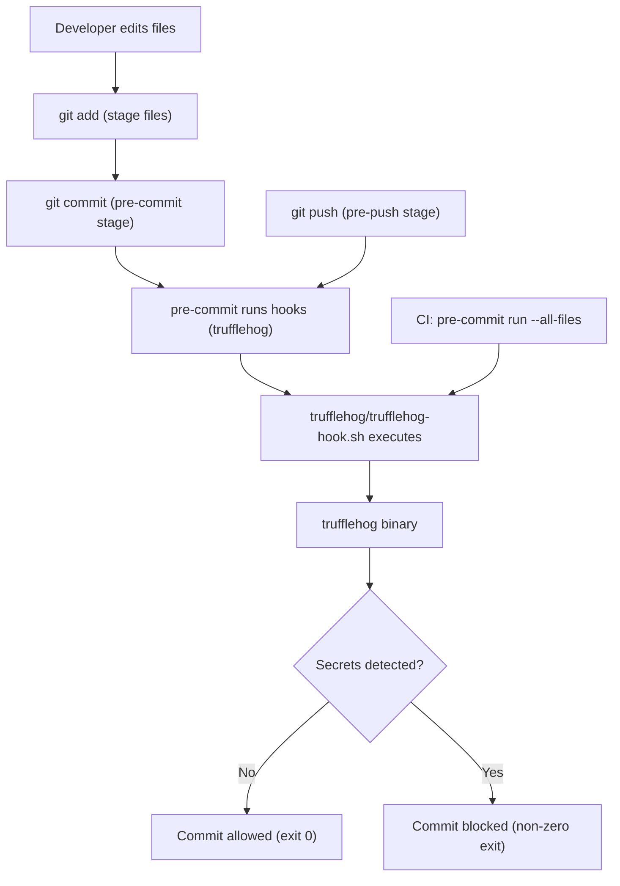
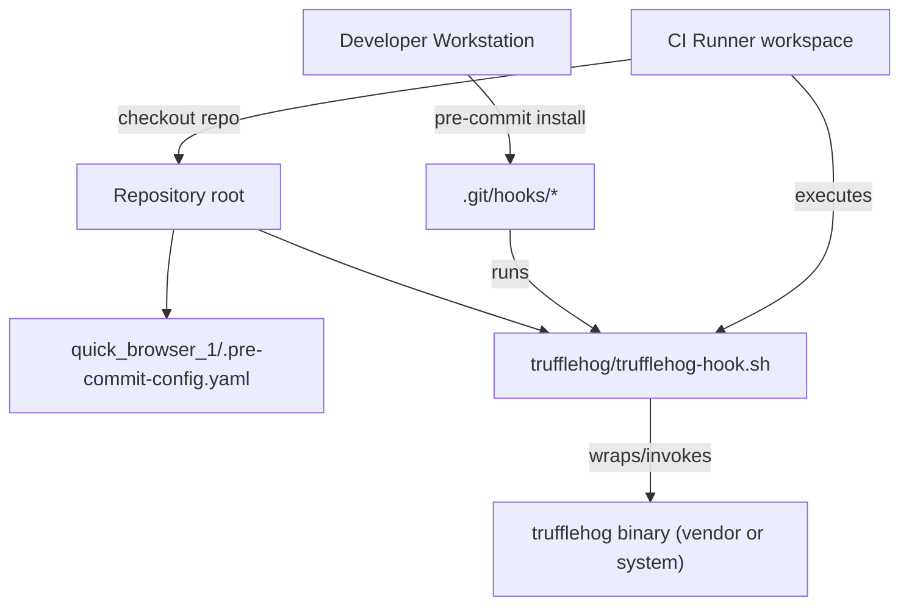

# Security and Repository Hygiene

## Cross-Topic Interactions
- CI/CD integration (example: CI Runner executes repository-level enforcement)
  - Representative interaction: CI job runs `pre-commit run --all-files` (uses `quick_browser_1/.pre-commit-config.yaml` and `trufflehog/trufflehog-hook.sh`) to enforce the same secrets scanning as local developer workflows.
  - Operational detail: CI images must provision the `trufflehog` runtime (or vendor a pinned binary) so the hook behaves identically in CI and on Developer Workstations.
- Developer Tooling (pre-commit installer and Git hooks)
  - Representative interaction: Developer Workstation runs `pipx install pre-commit` or `pip install pre-commit` and `pre-commit install` to populate `.git/hooks/*` from `quick_browser_1/.pre-commit-config.yaml`.
  - Operational detail: Local hook repository (`repo: local`) keeps `trufflehog/trufflehog-hook.sh` versioned with source for reproducible local installs.
- Secrets scanning runtime and dependency management
  - Representative interaction: Hook wrapper (`trufflehog/trufflehog-hook.sh`) invokes the `trufflehog` binary or module; runtime is controlled via environment variable `TRUFFLEHOG_BIN` or by vendoring/pinning a known-good artifact.
  - Operational detail: Pinning or vendoring avoids drift in scanner behavior across CI and developers.
- Repository policy, auditability, and exceptions
  - Representative interaction: Repository-level pre-commit rules in `quick_browser_1/.pre-commit-config.yaml` express enforcement stages (`pre-commit`, `pre-push`) and scope (`files` regex). Exceptions and bypasses should be recorded in CI job metadata or PR comments for audit.
  - Operational detail: Use `pre-commit run --all-files` in required pipeline jobs to capture bypass attempts and provide authoritative evidence for audits.
- Packaging and provisioning (example: pipx/pip, CI images)
  - Representative interaction: Installation instructions in the repository reference `pipx install pre-commit` and specify provisioning steps for CI images to include `trufflehog` and any pinned dependencies.

## Key Application Flows
1. Pre-commit staged-file scan (fast, local)
   - Trigger: `git commit`
   - Actors: Developer Workstation, pre-commit framework, `.git/hooks/*`
   - Artifacts: `quick_browser_1/.pre-commit-config.yaml`, `trufflehog/trufflehog-hook.sh`, staged file list
   - Behavior: pre-commit runs the `trufflehog` hook limited to staged files (fast heuristics); hook returns exit code 0 to allow commit or non-zero to block.
   - Failure handling: Developer fixes/rotates secrets or updates staged content and re-runs commit; use `pre-commit run trufflehog --all-files` to reproduce locally.

2. Pre-push repository-wide or history scan (broader, local)
   - Trigger: `git push`
   - Actors: Developer Workstation, pre-commit framework, `.git/hooks/pre-push`
   - Artifacts: `quick_browser_1/.pre-commit-config.yaml`, `trufflehog/trufflehog-hook.sh`, recent commits or repository history
   - Behavior: pre-push runs heavier scanning (e.g., scan recent commits or full repo) to catch secrets before reaching remote; longer runtime expected.
   - Failure handling: Block push until secrets are removed/rotated; if scan is unexpectedly slow, move exhaustive checks to CI.

3. CI enforcement (authoritative, reproducible)
   - Trigger: CI pipeline (e.g., PR job)
   - Actors: CI Runner, repository workspace, pre-commit
   - Artifacts: `quick_browser_1/.pre-commit-config.yaml`, `trufflehog/trufflehog-hook.sh`, CI image with pinned `trufflehog`
   - Behavior: CI runs `pre-commit run --all-files` (or explicit `trufflehog` invocation) to ensure consistent enforcement even when local hooks are bypassed or missing.
   - Failure handling: Fail the pipeline; require secret rotation and PR updates before merge.

4. Hook installation and update lifecycle
   - Trigger: repository change to hook script or pre-commit config; developer onboarding
   - Actors: Repository (committed `trufflehog/trufflehog-hook.sh`), Developer Workstation, CI Runner
   - Artifacts: `quick_browser_1/.pre-commit-config.yaml`, `trufflehog/trufflehog-hook.sh`, CI image recipe
   - Behavior: Developers run `pre-commit install` to refresh `.git/hooks/*`. CI must mirror the same scripts and pinned binaries to maintain parity.
   - Failure handling: Broken hook script should be corrected and PR-tested in CI with `pre-commit run --all-files` before merging.

## Developer Onboarding Guide
Learning path and practical steps for new contributors interacting with Pre-commit hooks and secrets scanning:

1. Read the configuration and wrapper
   - Files to inspect first:
     - `quick_browser_1/.pre-commit-config.yaml` — confirms hooks, IDs, stages (`pre-commit`, `pre-push`), and optional `files` regex.
     - `trufflehog/trufflehog-hook.sh` — shows how the runtime is invoked, expected args, and exit code behavior.
2. Install local tooling
   - One-time install: `pipx install pre-commit` (or `pip install pre-commit` in a venv).
   - Install hooks into the repo: `pre-commit install`.
3. Verify local behavior
   - Run the trufflehog hook against the workspace: `pre-commit run trufflehog --all-files`.
   - Reproduce commit-time behavior locally: stage files and run `git commit` to observe hook invocation via `.git/hooks`.
4. Understand and tune scope
   - If commit-time latency is high, inspect `files` regex in `.pre-commit-config.yaml` to limit checks to relevant extensions (e.g., `".*\\.(py|js|tf|yaml)$"`).
   - Use ignore patterns and wrapper tuning inside `trufflehog/trufflehog-hook.sh` to reduce false positives.
5. Debugging blocked commits/pushes
   - Run: `pre-commit run trufflehog --all-files` locally to get the same output as the hook.
   - If `trufflehog` is missing, verify `TRUFFLEHOG_BIN` or install `trufflehog` in your environment; check wrapper script error messages.
   - Confirm the hook file is executable: `chmod +x trufflehog/trufflehog-hook.sh`.
6. CI parity and enforcement
   - Confirm CI image includes the pinned `trufflehog` runtime or vendor the binary in the repository.
   - Expect CI job to run `pre-commit run --all-files` as part of PR gating; failures there are authoritative for merges.
7. Handling findings and exceptions
   - On true positive: follow repository incident playbook (rotate/expire secrets, replace them in code/config, update commits if necessary).
   - For documented exceptions: add exception tracking in PR metadata or CI artifact; prefer temporary CI flags over local bypasses.

Required skills: basic Git, shell scripting familiarity, comfort with pre-commit usage and CI YAML editing, and awareness of secret-rotation procedures.

## Visual Diagrams

### Primary architecture: Pre-commit hooks and secrets scanning components and actors
```mermaid
graph TD
  RepoConfig["quick_browser_1/.pre-commit-config.yaml"]
  HookScript["trufflehog/trufflehog-hook.sh"]
  TruffleHogBin["trufflehog binary (runtime)"]
  PreCommit["pre-commit (framework)"]
  GitHooks[".git/hooks/*"]
  DevWS["Developer Workstation"]
  CI["CI Runner"]

  DevWS -->|installs| PreCommit
  RepoConfig -->|defines hooks| PreCommit
  PreCommit -->|installs| GitHooks
  GitHooks -->|invokes| HookScript
  HookScript -->|executes| TruffleHogBin
  CI -->|runs (pre-commit run --all-files)| RepoConfig
  CI -->|executes| HookScript
```

### Cross-domain integration: CI/CD, packaging, and repository policy interactions with Pre-commit hooks
```mermaid
graph TD
  RepoConfig["quick_browser_1/.pre-commit-config.yaml"]
  HookScript["trufflehog/trufflehog-hook.sh"]
  CI["CI Runner (pipeline job)"]
  CIImage["CI Image (pinned trufflehog)"]
  PackageMgr["pipx / pip"]
  GitRemote["git remote (origin)"]
  AuditStore["Audit logs / PR metadata"]

  PackageMgr -->|installs| CIImage
  CIImage -->|contains| TruffleHogBin["trufflehog runtime"]
  CI -->|uses| CIImage
  CI -->|runs| RepoConfig
  RepoConfig -->|enforces| HookScript
  HookScript -->|writes findings| AuditStore
  GitRemote -->|receives pushes| CI
  AuditStore -->|used for| "exceptions & auditability"
```

### Internal process/workflow: commit -> scan -> decision (pre-commit / pre-push / CI)


### Component relationships: repository layout and hook wiring
