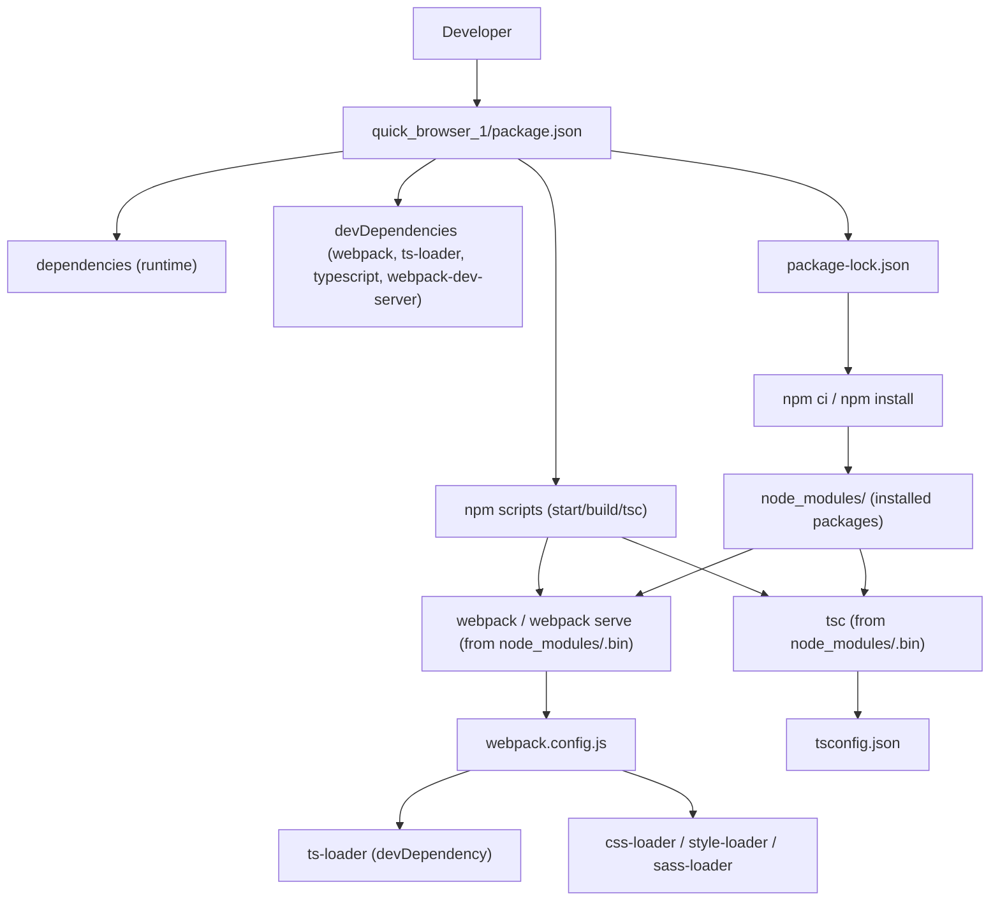
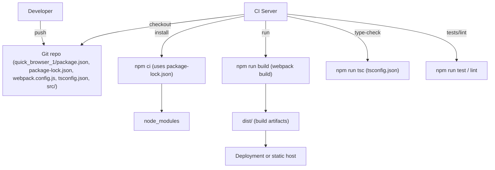
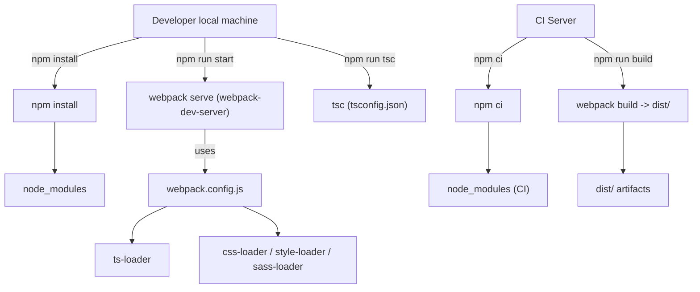
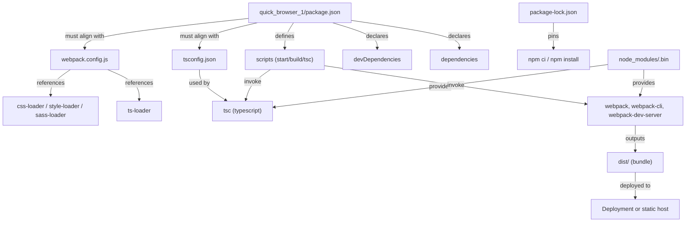

# Developer Tooling and Workflows

## Cross-Topic Interactions
- Dependency management and scripts ↔ CI Server (example)
  - Git repo (contains quick_browser_1/package.json and package-lock.json) → CI Server runs `npm ci` → `npm run build` → emits `dist/` artifacts for deployment to Deployment or static host.
- Dependency management and scripts ↔ Source code and build configs (example)
  - src/ (application code) is compiled/bundled by webpack using webpack.config.js and tsconfig.json referenced by quick_browser_1/package.json scripts (`start`, `build`, `tsc`).
- Dependency management and scripts ↔ Runtime/Hosting (example)
  - Artifacts in dist/ produced by `npm run build` are consumed by Deployment or static host; missing runtime modules placed incorrectly in devDependencies cause runtime errors after production install (NODE_ENV=production).
- Dependency management and scripts ↔ Developer tooling integrations (example)
  - Local developer flow: `npm install` populates node_modules; `npm run start` invokes webpack-dev-server (from devDependencies) for HMR. Editors/IDEs use tsconfig.json for IntelliSense/type-checking; precommit hooks or CI may run `npm run tsc`.
- Specific file-level dependencies:
  - quick_browser_1/package.json defines scripts that call binaries resolved from node_modules/.bin (webpack, tsc, webpack-dev-server).
  - webpack.config.js expects loaders (ts-loader, css-loader, style-loader, sass-loader) to be present in node_modules.
  - tsconfig.json must align with webpack.config.js (module target, outDir, sourceMap) to avoid duplicate or mismatched outputs.

## Key Application Flows
1. Build Process (CI-driven production build)
   - Step: CI Server checks out Git repo (including quick_browser_1/package.json and package-lock.json).
   - Command: `npm ci` (lockfile present) → deterministic node_modules.
   - Command: `npm run build` → invokes webpack (from node_modules/.bin) and webpack.config.js uses ts-loader + loaders to emit dist/ artifacts.
   - Output: dist/ artifacts uploaded/deployed to Deployment or static host.
   - Failure modes to watch: runtime packages incorrectly placed in devDependencies; incompatible major versions between webpack, webpack-cli, webpack-dev-server, and loaders.

2. Local Development (fast feedback with dev server)
   - Step: Developer runs `npm install`.
   - Command: `npm run start` → webpack-dev-server (webpack serve) runs with HMR, serving bundle from memory or configured dev output.
   - Supporting files: tsconfig.json used by editors and possibly ts-loader; webpack.config.js controls loaders and HMR behavior.
   - Developer checks: `npm run tsc` for full TypeScript-only type-checking when needed.

3. Type-check & Lint Gate (optional CI pre-step)
   - Command: `npm run tsc` executed in CI or precommit to validate types using TypeScript installed in devDependencies.
   - Integration: `tsc` uses tsconfig.json that should match module/outDir/sourceMap settings used by webpack/ts-loader.

4. Deterministic Install and Rollback
   - Command: `npm ci` in CI for reproducible installs based on package-lock.json.
   - Rollback: Revert package.json and commit a corresponding package-lock.json update; CI will reproduce the exact node_modules for a validated build.

## Developer Onboarding Guide
1. First things to read and run
   - Read quick_browser_1/package.json (scripts, dependencies vs devDependencies).
   - Open tsconfig.json to understand TypeScript targets and paths used by the repo.
   - Open webpack.config.js to understand bundling rules, loader usage (ts-loader, css-loader, style-loader, sass-loader), and dev server configuration.

2. Local setup (first-run checklist)
   - Run: `npm install`
   - Verify: `npm run start` → confirm webpack-dev-server serves the app; check HMR and console for loader errors.
   - Verify type-check: `npm run tsc` → confirm no type errors outside of webpack/ts-loader incremental builds.

3. Typical change workflow
   - Modify src/ files; use `npm run start` for iterative development.
   - Add a new dependency:
     - If runtime: `npm install <pkg> --save` → updates dependencies in quick_browser_1/package.json and package-lock.json.
     - If build-time: `npm install <tool> --save-dev` → updates devDependencies.
   - Update lockfile: always commit package-lock.json alongside package.json changes (`git add package.json package-lock.json`).
   - CI validation: push changes → CI runs `npm ci`, `npm run build`, and optional `npm run tsc`/tests.

4. When to modify configs
   - Update tsconfig.json when adding new TypeScript compiler options or changing module/outDir behavior; mirror those options in webpack.config.js or configure ts-loader to reference the same tsconfig.json.
   - Update webpack.config.js when adding new file types or changing bundling strategy; ensure required loaders are in devDependencies.

5. Required knowledge and troubleshooting skills
   - Familiarity with npm scripts, node_modules resolution (node_modules/.bin), and the difference between dependencies and devDependencies.
   - Understanding of TypeScript configuration (tsconfig.json) and Webpack configuration (webpack.config.js).
   - Ability to read CI logs to debug `npm ci` failures, Webpack build errors, and loader compatibility issues.

## Visual Diagrams

### 1) Primary architecture: Dependency management and scripts → build configs → node_modules

### 2) Cross-domain integration: repo → CI Server → build → deploy

### 3) Internal processes/workflows: Local dev and production build control flow

### 4) Component relationships: files and binaries mapping
