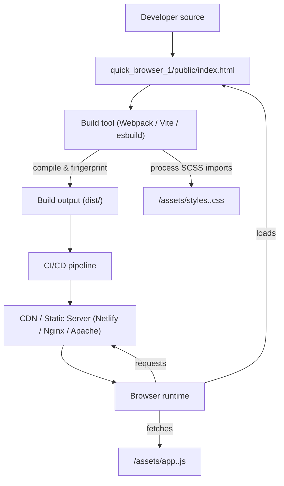
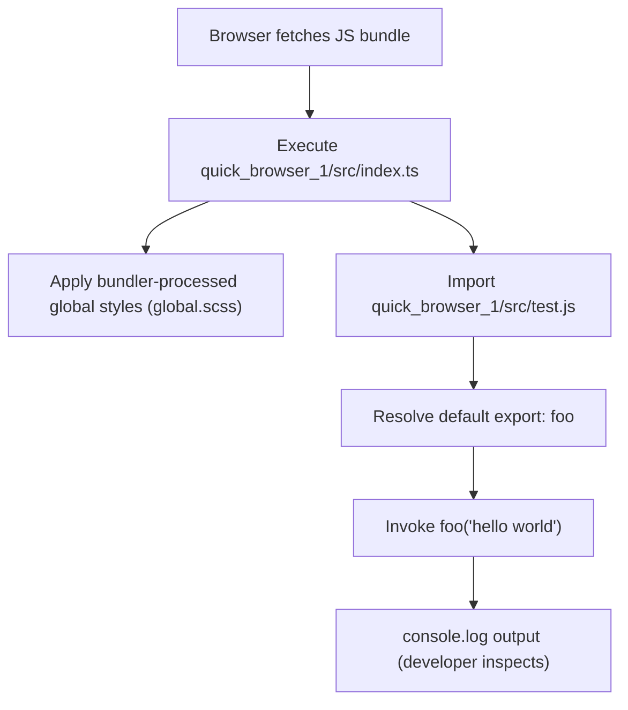
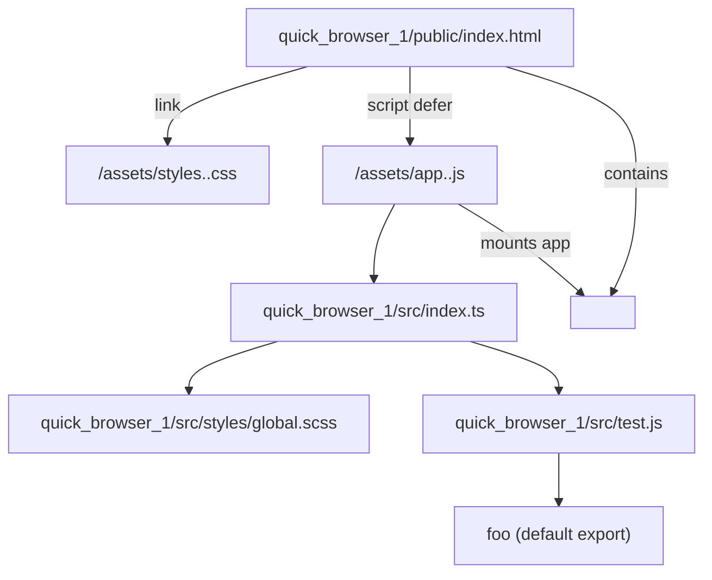

# Frontend Application

## Cross-Topic Interactions
- Interaction: Application bootstrapping and entry ↔ Client-side runtime utilities and logging  
  - quick_browser_1/src/index.ts imports default export from quick_browser_1/src/test.js and invokes foo('hello world') as the single deterministic runtime action. The runtime behavior depends on test.js export shape (callable function).
  - Example: index.ts performs `import foo from './test'; foo('hello world');`. Tests can stub/spy on quick_browser_1/src/test.js to observe startup behavior without applying styles.

- Interaction: Application bootstrapping and entry ↔ Static HTML and asset integration  
  - index.ts and its bundled output are referenced by quick_browser_1/public/index.html (build injects hashed JS bundle path). Bundler must process `import './styles/global.scss'` at build time so CSS is available before/when the JS runs.
  - Requirement: the bundler pipeline (Webpack / Vite / esbuild) must handle SCSS imports and produce CSS asset(s) that are injected or linked in public/index.html.

- Interaction: Static HTML and asset integration ↔ Deployment / Runtime Infrastructure  
  - Build artifacts (index.html, hashed JS/CSS under /assets) are published by CI/CD to a CDN / Static Server (Netlify, Nginx, Apache). Server rewrite rules (SPA fallback) and cache headers must be configured to allow client-side routing and fast asset caching.
  - Example: Nginx try_files $uri $uri/ /index.html for SPA fallback; immutable cache header for hashed assets, short TTL for index.html.

- Interaction: Client-side runtime utilities and logging ↔ Developer Tooling and Tests  
  - quick_browser_1/src/test.js is intentionally zero-dependency and synchronous (console.log). Test suites can replace this module with a stub to assert that index.ts invoked the helper without producing browser-visible side-effects like style injection.
  - Example: In unit tests, mock quick_browser_1/src/test.js to validate foo was called with 'hello world'.

## Key Application Flows

1. Application Startup Flow (module load → styles → logging)
   - Trigger: Browser loads JS bundle referenced by public/index.html
   - Steps:
     1. Browser fetches /assets/app.<hash>.js (defer ensures non-blocking)
     2. Module loader executes quick_browser_1/src/index.ts
     3. Side-effect import executes: bundler-injected CSS (./styles/global.scss) is applied
     4. Import resolver yields default export foo from quick_browser_1/src/test.js
     5. index.ts invokes `foo('hello world')` → console output
   - Components: quick_browser_1/public/index.html, quick_browser_1/src/index.ts, quick_browser_1/src/styles/global.scss, quick_browser_1/src/test.js

2. Build and Deploy Flow (source → build → inject → publish)
   - Trigger: CI/CD pipeline run (npm run build)
   - Steps:
     1. Build tool compiles JS/TS and SCSS, outputs hashed assets into dist/
     2. Build step injects or replaces placeholders in quick_browser_1/public/index.html with hashed filenames (e.g., app.<hash>.js, styles.<hash>.css)
     3. CI/CD publishes dist/ to CDN / Static Server
     4. Server sets cache headers: immutable long TTL for hashed assets, short TTL for index.html
   - Components: Build tool (Webpack/Vite/esbuild), quick_browser_1/public/index.html, CI/CD, CDN/Static Server

3. Debug / Inspection Flow (ad-hoc logging)
   - Trigger: Developer or runtime code calls foo
   - Steps:
     1. Consumer imports foo from quick_browser_1/src/test.js
     2. Call `foo(value)` writes to runtime console via console.log(value)
     3. Developer inspects browser console for payload
   - Constraints: synchronous, no formatting, development-time use only

4. SPA Routing & Asset Fetch Flow (runtime navigation)
   - Trigger: Browser requests route (direct URL or client-side navigation)
   - Steps:
     1. CDN/Static Server receives request and determines if static asset exists
     2. If not, server returns index.html (SPA fallback)
     3. Browser parses index.html, loads JS bundle, client router resolves route and mounts to #root
     4. Optional service worker registers and caches assets
   - Components: CDN/Static Server, quick_browser_1/public/index.html, client router, optional Service Worker

## Developer Onboarding Guide
- Core reading order:
  1. Static HTML and asset integration — understand public/index.html, build-time asset injection, cache rules, SPA fallback, and how assets are published.
  2. Application bootstrapping and entry — learn the minimal entry module pattern (quick_browser_1/src/index.ts), how global styles are applied via bundler-side SCSS import, and the single deterministic bootstrap action.
  3. Client-side runtime utilities and logging — inspect quick_browser_1/src/test.js to see the synchronous debug helper (foo) used by index.ts and other consumers.

- First tasks to get a runnable dev environment:
  - Run the build/watch command provided by the project (e.g., npm run dev or npm run build), ensuring the bundler handles SCSS imports.
  - Open quick_browser_1/public/index.html served by the dev server (or mount dist/ on a static server) and confirm that:
    - CSS from global.scss is applied
    - Console shows the 'hello world' log emitted by foo
    - The app mounts to <div id="root"> if applicable

- Typical change workflow:
  - Add or adjust global styles: edit quick_browser_1/src/styles/global.scss → rebuild → verify styles in browser.
  - Change bootstrap behavior: keep index.ts minimal; if additional bootstrap actions are required, factor them into testable modules and keep index.ts responsible only for side-effect imports and deterministic startup calls.
  - Update logging behavior: modify quick_browser_1/src/test.js for richer dev-time inspection, but avoid replacing it with heavy synchronous operations in production paths.
  - Deploy: run build, verify asset filenames are injected into quick_browser_1/public/index.html, publish dist/ to CDN, verify cache headers and SPA fallback rules.

- Testing and CI notes:
  - Unit tests can mock quick_browser_1/src/test.js to assert index.ts invokes foo with expected arguments without relying on actual console output.
  - Keep bootstrap logic minimal to allow deterministic, fast CI tests that assert module load triggers the expected call.

- Required skills for contributors:
  - Familiarity with modern JS bundlers (Webpack/Vite/esbuild) and their handling of CSS/SCSS as side-effect imports
  - Basic understanding of SPA deployment considerations (hashed assets, cache-control, server rewrite rules)
  - Knowledge of module mocking and simple unit test patterns for import-time side-effects

## Visual Diagrams

### 1) Primary architecture: how subtopics work together
```mermaid
graph TD
  PublicIndex["quick_browser_1/public/index.html"] -->|references| JSBundle["/assets/app.<hash>.js"]
  JSBundle -->|contains| Entry["quick_browser_1/src/index.ts (Application bootstrapping and entry)"]
  Entry -->|side-effect import| GlobalStyles["quick_browser_1/src/styles/global.scss"]
  Entry -->|imports| TestUtil["quick_browser_1/src/test.js (Client-side runtime utilities and logging)"]
  TestUtil -->|exports| Foo["default export: foo(x)"]
  Entry -->|invokes| Foo
  PublicIndex -->|hosts| RootDiv["<div id=\"root\">"]
```

### 2) Cross-domain integration: build → deploy → runtime


### 3) Internal process/workflow: Application Startup Flow


### 4) Component relationships: public/index.html ↔ assets ↔ runtime files
