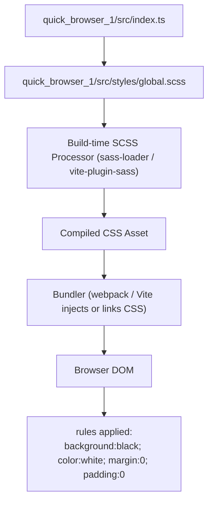
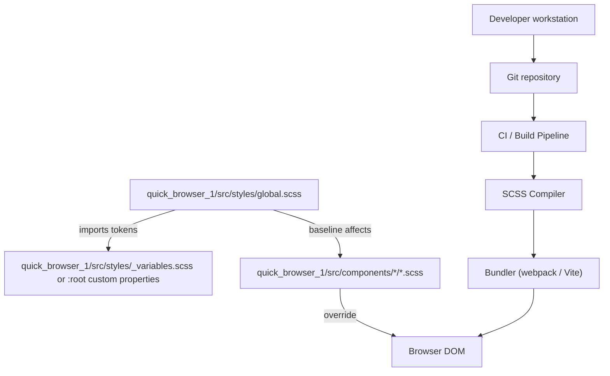
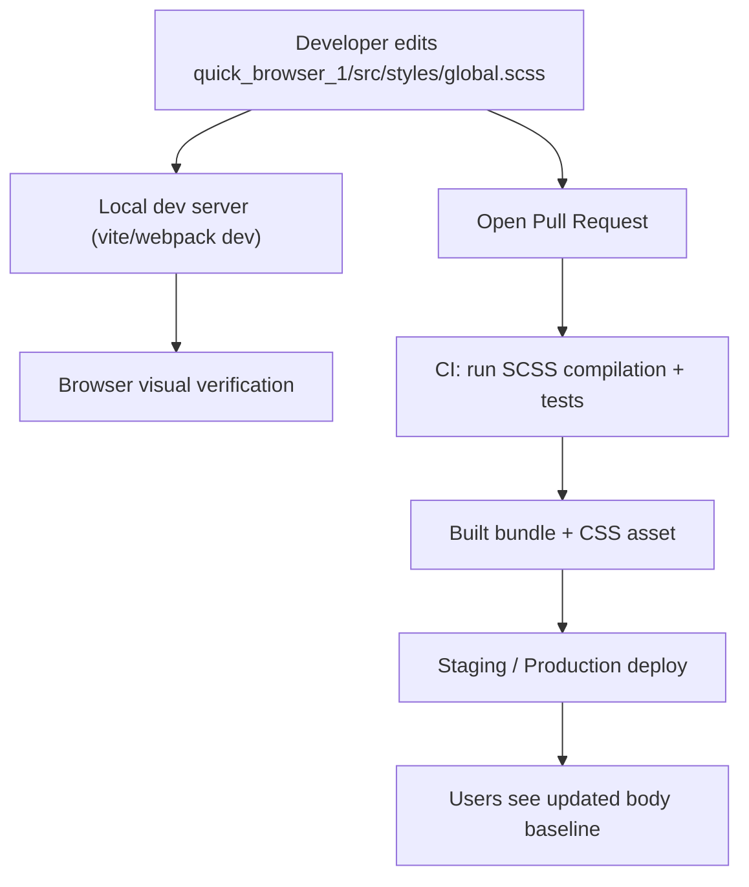
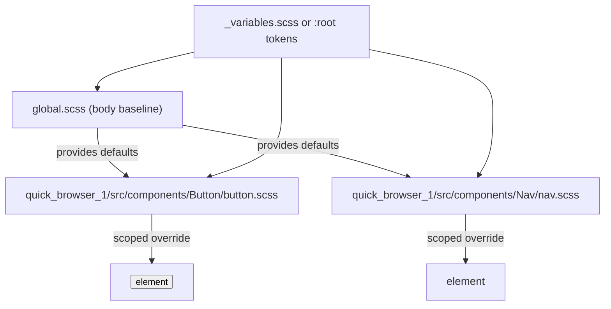

# Styling and Visual Design

## Cross-Topic Interactions
- Global styles and resets (quick_browser_1/src/styles/global.scss)
  - Consumed by application entry (quick_browser_1/src/index.ts) via `import './styles/global.scss'`.
  - Build-time dependency on the SCSS compilation toolchain (e.g., sass-loader, Vite SASS plugin) which must produce a CSS asset that the bundler emits or injects.
  - Interaction with component-level styling: component stylesheets (e.g., quick_browser_1/src/components/*/*.scss or .css) are expected to override or extend the `body` baseline. Global rules are intentionally minimal to avoid specificity conflicts.
  - Interaction with theming tokens: when migrating to token-based theming, a variables file (e.g., quick_browser_1/src/styles/_variables.scss or CSS custom properties in :root) becomes a collaborator with global.scss to provide centralized color/spacing tokens.
  - Interaction with application startup: import order in quick_browser_1/src/index.ts ensures global baseline is applied early to reduce flash-of-unstyled-content.
  - Interaction with CI/build pipelines: continuous integration must run SCSS compilation and include style linting or checks if enforced.

Examples:
- Import contract: quick_browser_1/src/index.ts -> import './styles/global.scss' requires build pipeline to compile SCSS and inject the resulting CSS into the HTML served to the browser.
- Component override scenario: quick_browser_1/src/components/Button/button.scss can set background-color and color; these rules will cascade over the global body defaults.

## Key Application Flows
1. Application Startup Flow (baseline injection)
   - quick_browser_1/src/index.ts imports quick_browser_1/src/styles/global.scss
   - Build-time SCSS processor compiles -> bundler injects CSS -> browser applies `body { margin:0; padding:0; background-color:black; color:white }`
   - Value: consistent baseline spacing and dark theme before component render.

2. Build-time SCSS Compilation Flow
   - Source (quick_browser_1/src/styles/global.scss, optional _variables.scss) -> SCSS compiler (sass-loader / vite-plugin-sass / dart-sass) -> Compiled CSS asset -> Bundler (webpack/vite) outputs/injects CSS.
   - Value: deterministic CSS asset generation and integration with dev server and production bundling.

3. Component Override and Theming Migration Flow
   - Global baseline remains minimal; component stylesheet authors add scoped styles that override body defaults.
   - When adding tokens: extract colors/spacing into quick_browser_1/src/styles/_variables.scss or implement CSS custom properties in :root; update global.scss to reference tokens; component styles read the same tokens.
   - Value: consistent tokens enable theming and runtime overrides while preserving minimal global rules.

4. Developer Change & CI Flow
   - Developer edits global.scss -> local dev server rebuilds/Hot Module Reloads -> visual verification in browser -> PR and CI run SCSS compilation and style checks -> merged and released.
   - Value: tight feedback loop and safe changes to app-wide defaults.

## Developer Onboarding Guide
1. Read global baseline
   - File to inspect: quick_browser_1/src/styles/global.scss
   - Purpose: minimal reset and dark theme baseline (body margin/padding reset + background-color black + color white).

2. Confirm import and bundler behavior
   - Check quick_browser_1/src/index.ts for `import './styles/global.scss'`.
   - Verify the project build config supports SCSS (look for sass-loader, vite-plugin-sass, or presence of dart-sass in package.json).
   - Start dev server and confirm CSS is injected and `body` rules are applied in browser devtools.

3. Follow style boundaries
   - Policy: keep only app-wide defaults in global.scss. Avoid element-specific and high-specificity selectors.
   - Put component styles in component-scoped files (quick_browser_1/src/components/*/).

4. Token migration path
   - When adding theme tokens, create quick_browser_1/src/styles/_variables.scss (SCSS variables) or add :root CSS custom properties.
   - Update global.scss to reference tokens rather than literal values to enable theming and runtime overrides.

5. Typical change workflow
   - Make small, scoped changes to global.scss with clear intent (spacing, colors).
   - Run local dev server, verify no regression in components.
   - Open a PR with screenshots or tests if UI baseline changes are visible.
   - CI must run SCSS compilation; address any build or style-lint failures prior to merge.

6. Required skills
   - Basic CSS/SCSS syntax and cascading rules.
   - Familiarity with the project bundler (webpack, Vite) and SCSS compilation pipeline.
   - Understanding of CSS specificity and component-level scoping patterns.

## Visual Diagrams

### 1. Primary architecture (how subtopics work together)

### 2. Cross-domain integration (connections to other system parts)

### 3. Internal processes/workflows (developer change -> verified deploy)

### 4. Component relationships (global baseline vs component scope)
