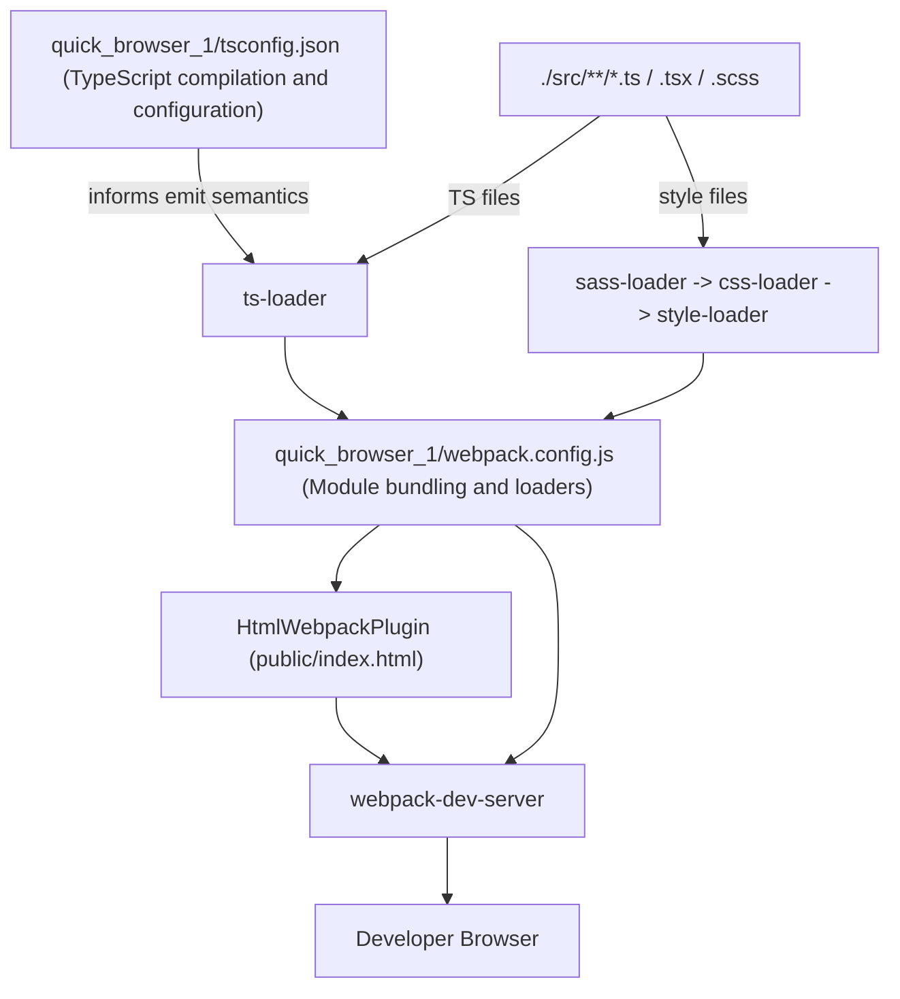
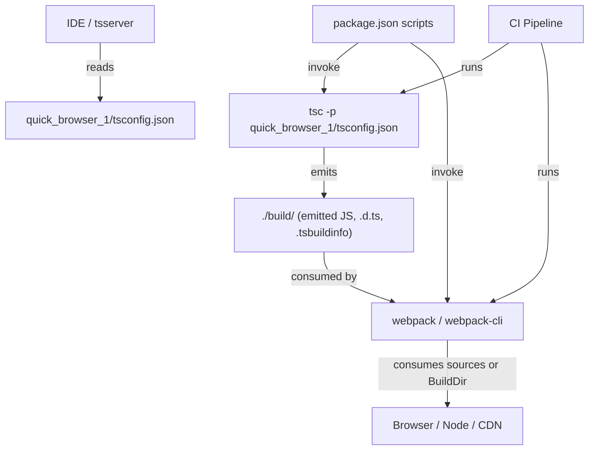
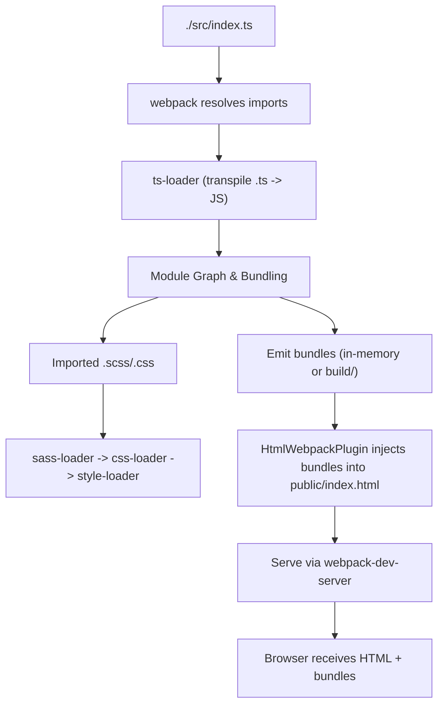
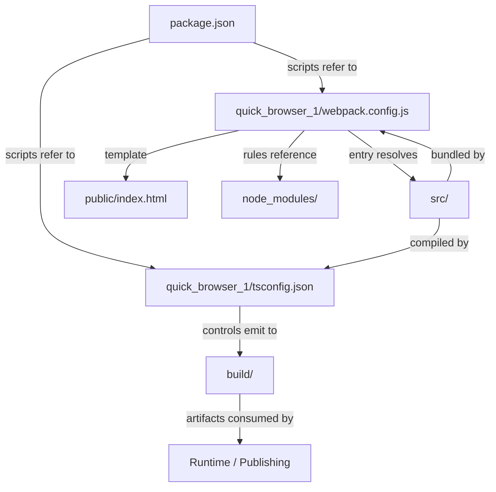

# Build and Compilation

## Cross-Topic Interactions
- TypeScript compilation feeding Module bundling and loaders
  - quick_browser_1/tsconfig.json defines emitted JS shape (module: "ES6", target: "es2016", outDir: "./build/"). The bundler (quick_browser_1/webpack.config.js) must accept or transform that emitted shape. Example: if webpack expects CommonJS, either set `module: "commonjs"` in tsconfig or configure webpack to handle ESM output.
- Editor/IDE diagnostics and CI
  - IDE/tsserver reads quick_browser_1/tsconfig.json to provide diagnostics and enforce `strict` rules. CI invokes `tsc -p quick_browser_1/tsconfig.json` (package.json scripts shown in TypeScript docs) to produce ./build/ artifacts consumed by downstream steps.
- Webpack dev server and Html template
  - quick_browser_1/webpack.config.js references HtmlWebpackPlugin with template ./public/index.html; webpack-dev-server serves the injected HTML and assets from memory or emits to build/.
- Loader/plugin runtime dependencies
  - sass-loader requires a Sass implementation (e.g., `sass`); css-loader/style-loader are runtime loader chain partners. MiniCssExtractPlugin is a production-time replacement for style-loader to extract CSS files.
- Optional tooling integration
  - ts-loader performance modes (`transpileOnly`) pair with fork-ts-checker-webpack-plugin to offload type checking. Incremental tsc (`incremental` + tsBuildInfoFile) affects local/CI speed and caching strategies used by build runners.
- Package scripts and artifact consumers
  - package.json scripts invoke both tsc and webpack: `tsc -p quick_browser_1/tsconfig.json` and `webpack serve` (or webpack CLI). Emitted artifacts in ./build/ are consumed by bundlers, Node runtime, or published packages (when `declaration` is enabled).

## Key Application Flows
1. TypeScript emission consumed by webpack (Development Build Flow)
   - Entry: ./src/index.ts
   - Compilation path: webpack resolves the entry -> ts-loader transforms `.ts` to JS according to quick_browser_1/tsconfig.json semantics -> webpack builds module graph -> HtmlWebpackPlugin injects bundles into public/index.html -> webpack-dev-server serves page to browser (hot reload supported).
   - Files/components: quick_browser_1/webpack.config.js, ts-loader, quick_browser_1/tsconfig.json, HtmlWebpackPlugin, public/index.html.

2. Frontend Asset Bundling Pipeline (CSS/Sass handling)
   - When a module imports styles (e.g., src/styles/main.scss), loader pipeline executes: sass-loader -> css-loader -> style-loader (right-to-left application). For production replace style-loader with MiniCssExtractPlugin.loader to emit CSS files into build/.
   - Files/components: src/**/*.scss|.css, quick_browser_1/webpack.config.js rules, sass implementation package, MiniCssExtractPlugin for production.

3. Local incremental development (Editor + tsc --watch + webpack)
   - Developer edits TypeScript -> IDE/tsserver uses quick_browser_1/tsconfig.json to show diagnostics immediately -> `tsc --watch -p quick_browser_1/tsconfig.json` emits incremental updates to ./build/ (optional) -> webpack-dev-server watches sources and triggers incremental rebuilds in-memory -> browser reflects changes via HMR or live reload.

4. CI production build and publish (declarations + artifact output)
   - CI runs `tsc -p quick_browser_1/tsconfig.json` with `declaration` enabled to produce `.d.ts` and JS into ./build/ -> CI runs webpack (or bundler) configured for production mode (mode: "production", MiniCssExtractPlugin) to produce minified artifacts -> artifacts are published or deployed. Key tsconfig adjustments: declaration, declarationMap, incremental/tsBuildInfoFile for caching.

## Developer Onboarding Guide
1. Learn quick_browser_1/tsconfig.json (TypeScript compilation and configuration)
   - Study active options: `target: "es2016"`, `module: "ES6"`, `moduleResolution: "node"`, `allowJs: true`, `outDir: "./build/"`, `esModuleInterop: true`, `strict: true`, `skipLibCheck: true`.
   - Run basic compile commands from package.json:
     - npm run build  => `tsc -p quick_browser_1/tsconfig.json`
     - npm run watch  => `tsc -p quick_browser_1/tsconfig.json --watch`
   - Understand implications of `outDir` (avoid placing it inside source tree) and `esModuleInterop` (import form differences).

2. Inspect quick_browser_1/webpack.config.js (Module bundling and loaders)
   - Read entry/output, module.rules, plugins, and resolve.extensions.
   - Note loader chains and order (applied right-to-left): `.ts` -> ts-loader; `.scss` -> sass-loader -> css-loader -> style-loader.
   - Confirm HtmlWebpackPlugin template path (./public/index.html) and output path (path.resolve(__dirname, "build")).

3. Run the local development loop
   - Start dev server: `webpack serve` (or npm script that runs it). Dev server serves the HtmlWebpackPlugin-injected page and watches for changes.
   - While editing, rely on IDE diagnostics from tsserver and on webpack-dev-server for asset reloads.
   - For fast type-checking during bundling, consider switching ts-loader to `transpileOnly: true` and adding fork-ts-checker-webpack-plugin.

4. Production adjustments and CI
   - In production webpack config: set `mode: "production"`, replace `style-loader` with `MiniCssExtractPlugin.loader`, enable source maps as needed, enable caching/minimizers.
   - For library publishing: enable `declaration` and `declarationMap` in quick_browser_1/tsconfig.json and ensure package.json `types` points to the generated `.d.ts` file in ./build/.
   - Use `incremental` and `tsBuildInfoFile` to speed up repeated CI builds and local iterations.

5. Troubleshooting checklist (quick actionable items)
   - If imports fail: verify `resolve.extensions` and `moduleResolution: "node"` correspond to import paths.
   - If styles don’t appear: confirm loader order (sass-loader -> css-loader -> style-loader) and presence of a Sass runtime (`sass`).
   - If builds are slow: exclude node_modules from ts-loader, enable `transpileOnly` and fork type-checking to a separate plugin, or add `incremental`.
   - If emitted artifacts re-trigger builds: ensure outDir is excluded from source includes and from webpack watch paths.
   - If bundler/runtime mismatch occurs: align tsconfig `module`/`target` with runtime or add a transform (e.g., Babel) to match runtime expectations.

## Visual Diagrams

### 1) Primary architecture: TypeScript compilation and Module bundling and loaders

### 2) Cross-domain integration: how build artifacts interact with CI, IDE, and runtime

### 3) Internal process/workflow: Frontend asset bundling pipeline (detailed)

### 4) Component relationships: files and configuration mapping
