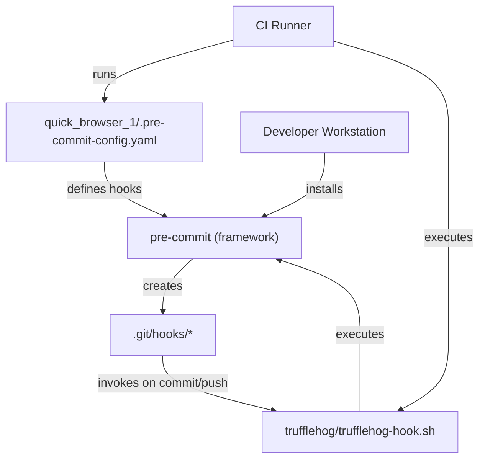
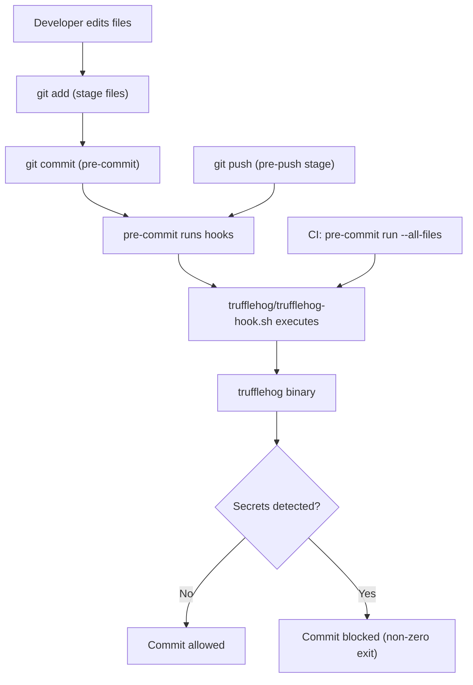

# Pre-commit hooks and secrets scanning

## Context: Developer Tooling & Security (ci-cd, security, hooks)

This subtopic documents how a repository-level pre-commit configuration integrates a local TruffleHog-based secrets scanner into developer and CI workflows to prevent secrets leaking via commits or pushes. Primary file: `quick_browser_1/.pre-commit-config.yaml`. Key relational tags: `ci-cd`, `security`, `hooks`.

## Key Abstractions

- **Local hook repository**  
  - Concept: `repo: local` in pre-commit config declares in-repo hooks. This keeps hook scripts versioned alongside source and avoids external dependency resolution at install time.
  - Role: Stores hook definitions that pre-commit installs into `.git/hooks`.

- **Hook script / wrapper pattern**  
  - Concept: A small executable script (e.g., `trufflehog/trufflehog-hook.sh`) wraps the actual scanner binary/command and normalizes I/O/exit codes.  
  - Role: Encapsulates invocation, arguments, file targeting, environment checks, and human-friendly output.

- **Stage-based scoping (pre-commit / pre-push)**  
  - Concept: Hooks are attached to Git stages (`pre-commit`, `pre-push`) to balance speed vs. coverage.  
  - Role: Fast checks on commit, heavier scans on push or CI.

## Collaborative Use Case

Files and actors collaborate to run secrets scanning during developer workflows and CI checks.

- Files:
  - `quick_browser_1/.pre-commit-config.yaml` — pre-commit configuration (local repo entry).
  - `trufflehog/trufflehog-hook.sh` — executable script invoked by pre-commit (entry).
  - (Runtime) `trufflehog` binary or Python module — actual secrets detector invoked by the hook script.

- Actors:
  - Developer workstation (with pre-commit installed)
  - pre-commit framework (installs and invokes hooks)
  - Git (commit/push lifecycle)
  - CI runner (optional enforcement via `pre-commit run --all-files`)

Example `quick_browser_1/.pre-commit-config.yaml` snippet:
```yaml
repos:
  - repo: local
    hooks:
      - id: trufflehog
        name: TruffleHog
        description: Detect secrets in repository data
        entry: trufflehog/trufflehog-hook.sh
        language: script
        stages: ["pre-commit", "pre-push"]
```

Example `trufflehog/trufflehog-hook.sh` (illustrative):
```bash
#!/usr/bin/env bash
set -euo pipefail

# Example wrapper: adjust path/flags as needed
TRUFFLEHOG_BIN="${TRUFFLEHOG_BIN:-trufflehog}"
ARGS=( --json )

# Optionally limit scan to staged files or all files based on stage/args
# For pre-commit: scan staged files; for pre-push: scan all files or recent commits

# Run trufflehog and propagate non-zero exit for failures
"$TRUFFLEHOG_BIN" "${ARGS[@]}" "$@"
exit $?
```

Installation & test commands (developer/CI):
```bash
# Install pre-commit (one-time)
pipx install pre-commit   # or pip install pre-commit

# Install hooks into .git/hooks
pre-commit install

# Run the configured trufflehog hook against all files
pre-commit run trufflehog --all-files
```

Behavior contract:
- Hook must be executable (chmod +x `trufflehog/trufflehog-hook.sh`).
- Hook must return exit code `0` for success or non-zero to block commit/push.
- Heavy scans can be limited by `files` regex or moved to `pre-push`/CI.

## Application Flow Integration

This subtopic supports the following flows:

1. Pre-commit checks (fast, local)  
   - Trigger: `git commit`  
   - Purpose: Quickly catch obvious secrets in staged files to avoid noisy feedback loops.  
   - Guidance: Keep runtime short; focus on staged-file scanning and fast heuristics.

2. Pre-push checks (broader, local before remote)  
   - Trigger: `git push`  
   - Purpose: Run heavier or repository-wide scans (e.g., commit history) to catch secrets before they reach remote.  
   - Guidance: Use pre-push for expensive scanning; accept longer runtime here.

3. CI enforcement (authoritative)  
   - Trigger: CI job (e.g., on PR) runs `pre-commit run --all-files` or explicit scanner invocation  
   - Purpose: Ensure centralized, reproducible enforcement even when local hooks are bypassed or missing in contributor environments.  
   - Guidance: Pin third-party hooks, provision CI images with required binaries, and run full-history scans where appropriate.

Operational considerations:
- False positives: Provide ignore patterns or tuning in wrapper script to reduce friction.
- Performance: Limit scanning with `files` regex in `.pre-commit-config.yaml` for commit-time hooks; run exhaustive scans in CI or pre-push.
- Reproducibility: For third-party hooks, pin `rev`. For local hooks, ensure CI workspace contains the same script and dependencies.

## Visual Diagrams

### File collaboration (repository layout and relationships)


### Data / control flow (commit -> scan -> decision)


## Troubleshooting & Best Practices

- Ensure `trufflehog/trufflehog-hook.sh` has an appropriate shebang and executable bit: `chmod +x trufflehog/trufflehog-hook.sh`.
- Keep commit-stage hooks fast; add `files` regex to limit scope:
  ```yaml
  files: ".*\\.(py|js|tf|yaml)$"
  ```
- For guaranteed enforcement, mirror local hook execution in CI: `pre-commit run --all-files` as a required job in pipeline.
- Document how to bypass (if absolutely necessary) and record exceptions for auditability — prefer temporary CI flags over habitual bypasses.
- Pin external tools or vendor a known-good binary to avoid drift in scanner behavior.

## References (commands & checks)

- Validate config and run locally:
  - `pre-commit install`
  - `pre-commit run --all-files` or `pre-commit run trufflehog --all-files`
- Make wrapper script robust:
  - Exit non-zero on findings
  - Provide a `--quiet` / `--verbose` mode controlled via args/env
  - Check for required binaries and print actionable errors when missing

