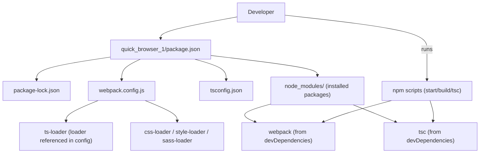
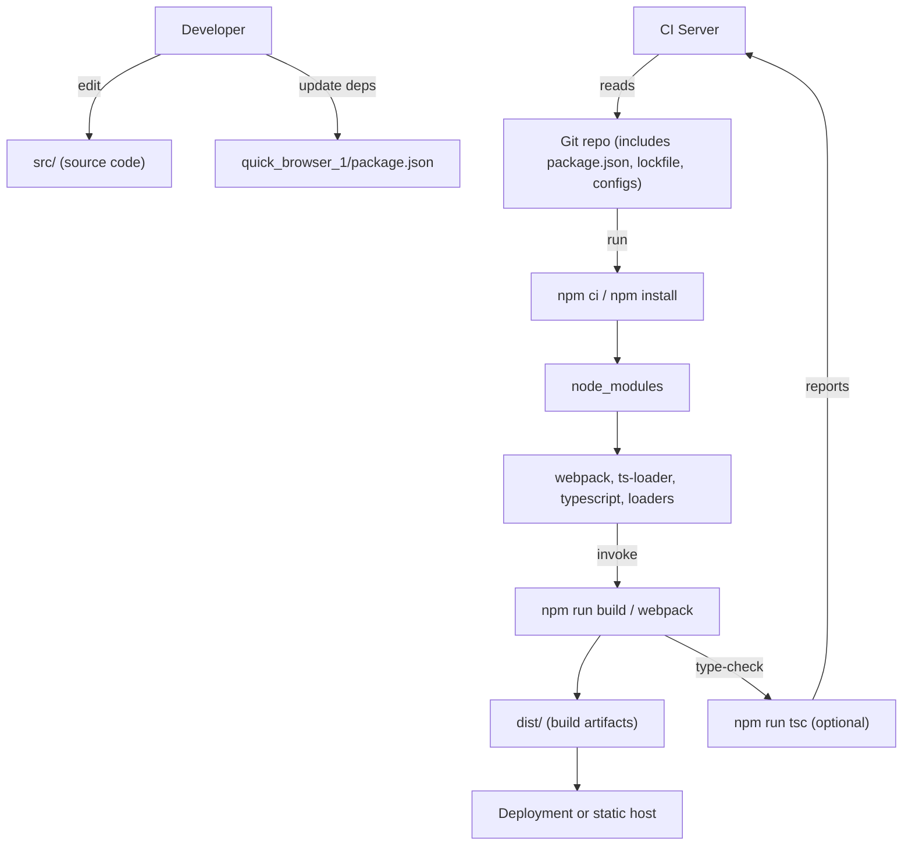

# Dependency management and scripts

## Context: Dependency Management & Build Tooling (frontend)
- Domain: Dependency Management & Build Tooling
- Architectural layer: Build & Tooling
- Relational tags: dependency-management, build-tooling, frontend
- Scope: single package manifest configuring TypeScript + Webpack frontend workflows for local development and CI

## Key Abstractions
- **Package manifest (Configuration File)**  
  The `quick_browser_1/package.json` file is the canonical Node/npm manifest that declares package metadata, `dependencies`, `devDependencies`, and `scripts`. It is the single source of truth for what to install and how to run builds/tests locally and in CI.

- **Separation of concerns: runtime vs build-time**  
  - *dependencies*: runtime libraries required in production (e.g., `lodash`).  
  - *devDependencies*: build-time tools and types (e.g., `webpack`, `ts-loader`, `typescript`, `webpack-dev-server`).  
  This separation drives install behavior in production (NODE_ENV=production) and CI.

- **Scripts as lightweight task runner / orchestration layer**  
  NPM scripts in `package.json` expose common developer actions (start dev server, build production bundle, run tsc). Scripts run with `node_modules/.bin` on PATH and orchestrate tool invocation without global installs.

## Collaborative Use Case
This section shows how `quick_browser_1/package.json` collaborates with build configs and CI to enable local development and production builds.

### How files work together (summary)
- `quick_browser_1/package.json` lists the required runtime and build tools and defines commands (`start`, `build`, `tsc`) that invoke those tools.
- `tsconfig.json` provides TypeScript compiler options consumed either by standalone `tsc` or by `ts-loader` inside Webpack.
- `webpack.config.js` references loaders (ts-loader, css-loader, style-loader, sass-loader) and defines bundling rules used by `webpack` and `webpack-dev-server`.
- `package-lock.json` (or yarn.lock) pins exact transitive versions and is used by CI for reproducible installs.
- CI runs `npm ci` (if lockfile present) or `npm install`, then `npm run build` and/or tests.

### Concrete examples (scripts and commands)
Example excerpt of `quick_browser_1/package.json` scripts:
```json
{
  "scripts": {
    "start": "webpack serve",
    "build": "webpack build",
    "tsc": "tsc",
    "test": "echo \"No tests configured\" && exit 0"
  }
}
```

Common developer flows:
- Local dev server
  - Install: `npm install`
  - Start dev server: `npm run start` (runs `webpack serve` using `webpack-dev-server` from devDependencies)
- Production build
  - CI install: `npm ci` (uses package-lock.json)
  - Build: `npm run build` (runs `webpack build`)
- Type-checking
  - `npm run tsc` (runs the TypeScript compiler using `typescript` from devDependencies)

### Best-practice interactions
- Keep `tsconfig.json` and `webpack.config.js` aligned (module target, outDir, sourceMap settings) to avoid duplicate or inconsistent outputs when using `tsc` and `ts-loader`.
- Commit `package-lock.json` (or equivalent) to ensure deterministic CI installs.
- Do not place runtime imports in `devDependencies`; production installs that prune devDependencies will fail at runtime.
- Prefer `npm ci` in CI pipelines for deterministic installs when a lockfile is present.

## Application Flow Integration
This subtopic enables the following key flows:

- Build Process
  - Dependency resolution: `npm install` / `npm ci` → node_modules populated according to `quick_browser_1/package.json` and lockfile.
  - Compile & bundle: `npm run build` → `webpack` reads `webpack.config.js`, uses `ts-loader` and other loaders from devDependencies, emits `dist/` artifacts.
  - Artifacts used for deployment (CD or static hosting).

- Local Development
  - Fast feedback loop: `npm run start` → `webpack-dev-server` serves bundle with HMR/config options, using local dependencies and webpack config.
  - Developer type-checking: `npm run tsc` for full TypeScript checks (optionally run in precommit or CI).

- CI / Automated workflows
  - Deterministic install: `npm ci` → `npm run build` → run tests/lint/type-check → produce build artifacts and exit with status for pipeline gating.

## Visual Diagrams

### 1) File collaboration (package manifest -> configs -> node_modules)


### 2) Data / control flow (developer → install → build → artifact → CI)


## Troubleshooting & common pitfalls
- Missing runtime packages in `dependencies` (placed in `devDependencies`) → runtime errors in production builds.
- Incompatible major versions between `webpack`, `webpack-cli`, `webpack-dev-server`, and loaders → cryptic build failures. Keep major versions aligned.
- Running both `tsc` and `webpack` with `ts-loader` without consistent `tsconfig.json` settings → duplicate compilation or mismatched outputs.
- Relying on global tool installations: npm scripts rely on `node_modules/.bin` being on PATH; ensure scripts use local binaries.
- Not committing lockfile: non-deterministic installs across machines and CI.

## Maintenance checklist
- Update both `package.json` and lockfile together; run `npm install` and commit `package-lock.json`.
- When upgrading build tools (webpack/loaders/ts-loader), update `webpack.config.js` and test local dev server and production build.
- Add lifecycle scripts intentionally (prebuild, postinstall) and document them.
- Use `npm ci` in CI when lockfile exists for reproducible builds.

<!-- End of documentation -->