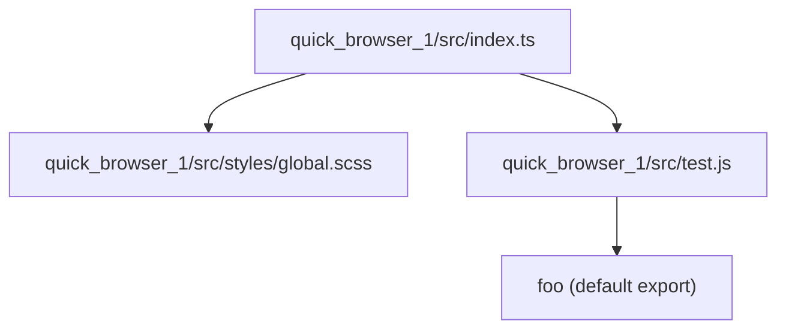
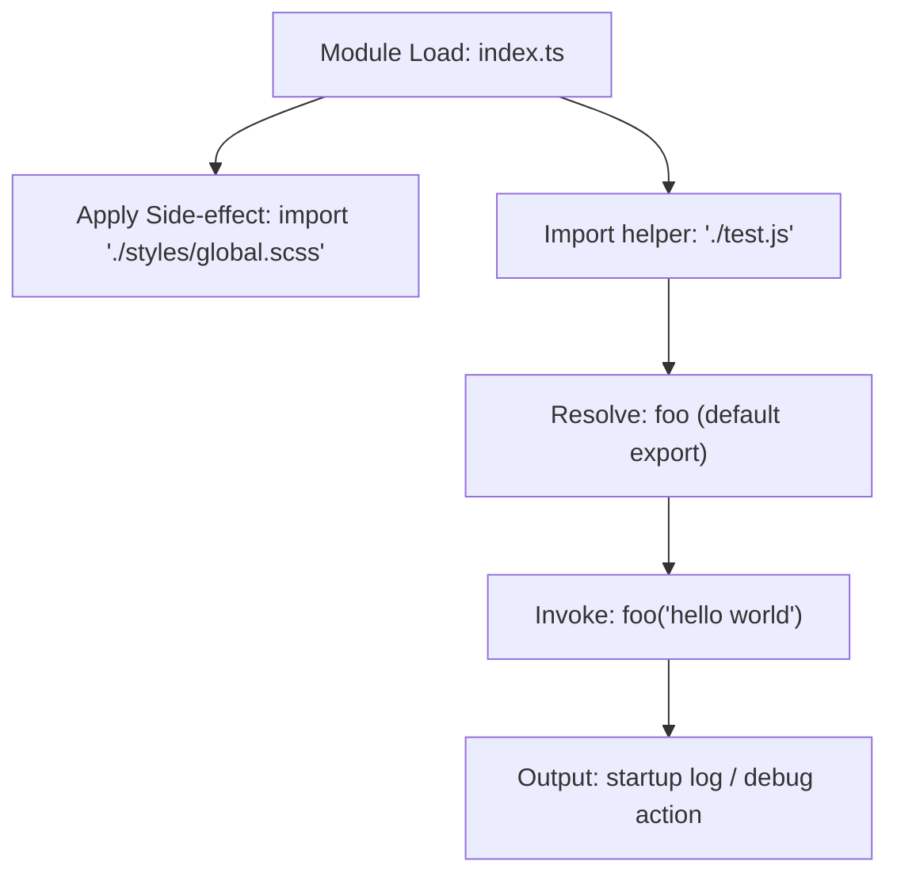

# Application bootstrapping and entry

## Overview: Domain & role
- Domain: Developer Utilities / Bootstrapping (Presentation Layer)
- Relational tags: `entrypoint`, `presentation`, `logging`
- Role: Minimal application entry point that applies global presentation styles as a side-effect and performs a single deterministic startup action (logging) to signal application startup.

## Key Abstractions
- **Entry Point (module-level bootstrap)**  
  A single top-level module (`quick_browser_1/src/index.ts`) that runs at application startup and is not intended to export runtime APIs. Its responsibilities are intentionally minimal to keep startup deterministic.

- **Side-effect Style Import**  
  Importing `./styles/global.scss` purely for side-effects so the bundler injects global CSS/theme defaults at load time. This pattern separates style application from component logic while ensuring styles are applied as early as possible.

- **Bootstrap Action / Logging Helper**  
  A small, testable helper function (`foo`) exported as the default from `./test.js` used as the single runtime side-effect. This keeps the bootstrap behavior easy to inspect, mock, and assert in tests.

## Collaborative Use Case
Files and symbols involved:
- `quick_browser_1/src/index.ts` — application entry point (no exports)
- `quick_browser_1/src/styles/global.scss` — side-effect import for global styles
- `quick_browser_1/src/test.js` — default-exported function `foo` used as a logging/debug helper

How they work together (code example):
```typescript
// quick_browser_1/src/index.ts
import './styles/global.scss'; // side-effect: bundler applies global CSS
import foo from './test';     // default export: function foo(msg: string)

foo('hello world');           // single deterministic bootstrap action
```

Contracts and expectations:
- `./styles/global.scss` must be handled by the bundler pipeline (no runtime JS API).
- `./test.js` must default-export a callable function that accepts a single argument (string).
- `index.ts` is executed at startup and intentionally does not export symbols; it is the top-level runtime entry.

Testing/mocking notes:
- Because the bootstrap performs a single deterministic call to `foo`, tests can stub or spy on `./test` to verify that startup behavior occurs without executing style side-effects.
- Keeping logic minimal reduces test surface and makes CI-friendly boot verification straightforward.

## Application Flow Integration
Flow: Application Startup Flow (module load → style application → logging invocation)

Core steps this subtopic enables:
1. Runtime module load of `quick_browser_1/src/index.ts`.
2. Bundler-applied global styles via `import './styles/global.scss'`.
3. Import of the logging helper from `./test.js`.
4. Invocation of `foo('hello world')` to emit a startup message or perform a lightweight side-effect.

Sequence (textual):
- Module resolution loads `index.ts`.
- Side-effect import triggers style injection by the bundler.
- Import binder resolves `./test.js` and retrieves default export `foo`.
- `foo` is invoked with the startup message.

## Visual Diagrams

### File collaboration (imports / exports)


### Application startup control/data flow


## Implementation example
- Reference source (concise):
```typescript
import './styles/global.scss';
import foo from './test';

foo('hello world');
```

## Notes on design choices
- Keep the entry module minimal to avoid unpredictable side-effects on startup.
- Use bundler-side SCSS processing so style concerns are applied before UI renders.
- Use a single, small logging helper for observable startup behavior; this improves testability and isolation.