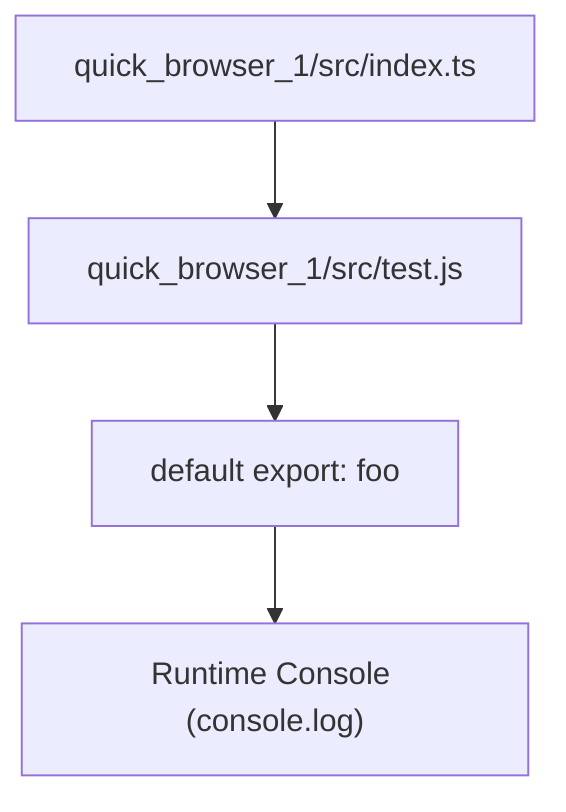
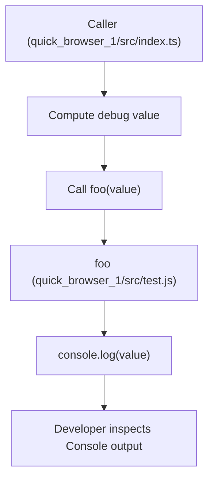

# Client-side runtime utilities and logging

## Summary
A tiny, synchronous client-side logging utility provided as a single default export. Domain: **Developer Utilities**. Architectural layer: **Infrastructure Layer**. Relational tags: **logging**, **utility**, **debugging**. Purpose: centralize a minimal debug/inspection helper so callers can emit quick console output during runtime.

## Key Abstractions
- **Single-function utility**  
  - Pattern: tiny, focused utility module (moduleType: *Utility*).  
  - Abstraction: one exported function `foo` that accepts any value and performs a side-effect (writes to `console.log`).  
- **Synchronous side-effect**  
  - Design choice: immediate, predictable observable output for ad-hoc debugging; no async behavior, no return value.  
- **Zero-dependency contract**  
  - No runtime dependencies or configuration; typed loosely (accepts any input) to maximize flexibility for ad-hoc inspection.

## Public API
Default export: `foo`

```javascript
// Signature
function foo(x)

// Behavior
// Logs the provided value to the runtime console
// Side-effect only: console.log(x)
// No return value (undefined)
```

Example usage:

```javascript
import foo from './test.js';

foo('debug info'); // writes 'debug info' to the browser console
```

Source file: quick_browser_1/src/test.js  
Exported symbol: `foo`

## Collaborative Use Case
Files involved:
- quick_browser_1/src/test.js — the logging utility (exports default `foo`)
- quick_browser_1/src/index.ts — example consumer (computes/collects debug value and calls `foo`)

Interaction pattern:
1. Consumer computes or collects a value to inspect.
2. Consumer imports `foo` from quick_browser_1/src/test.js.
3. Consumer calls `foo(value)`.
4. `foo` calls `console.log(value)` and returns undefined.

Concrete example (consumer):

```javascript
// quick_browser_1/src/index.ts (example)
import foo from './test.js';

const debugPayload = { userId: 123, step: 'init' };
foo(debugPayload); // immediate console output for developer inspection
```

Notes:
- No runtime dependency injection required.
- Intended for development-time debugging or quick inspection; not for structured or production logging.

## Application Flow Integration
This utility participates in simple debug/inspection flows (no multi-step business flows). Key flow enabled:

- "Invoke Debug Helper" flow:
  - Caller computes value → imports `foo` → calls `foo(value)` → console receives the logged value → developer inspects output.

FlowParticipation: none (no higher-level business flows are altered by this module). The utility is a cross-cutting, infrastructure-level helper used wherever ad-hoc logging is needed.

## Usage Constraints & Considerations
- Synchronous: immediate console side-effect; safe for quick debugging but not suitable for heavy or asynchronous logging needs.
- No formatting, levels, or metadata: plain `console.log`.
- No input validation: accepts any value and forwards it to console.
- Not intended as a replacement for structured logging or production telemetry.

## Visual Diagrams

### File collaboration (import/export relationships)


### Data / Control flow for a debug call


## Implementation snapshot
Example minimal implementation (reflects current module):

```javascript
// quick_browser_1/src/test.js
export default function foo(x) {
  console.log(x);
}
```

## Quick reference
- File: quick_browser_1/src/test.js  
- Symbol: `foo` (default export)  
- Behavior: synchronous console logging of provided value  
- Intended use: ad-hoc debugging/inspection in development environments