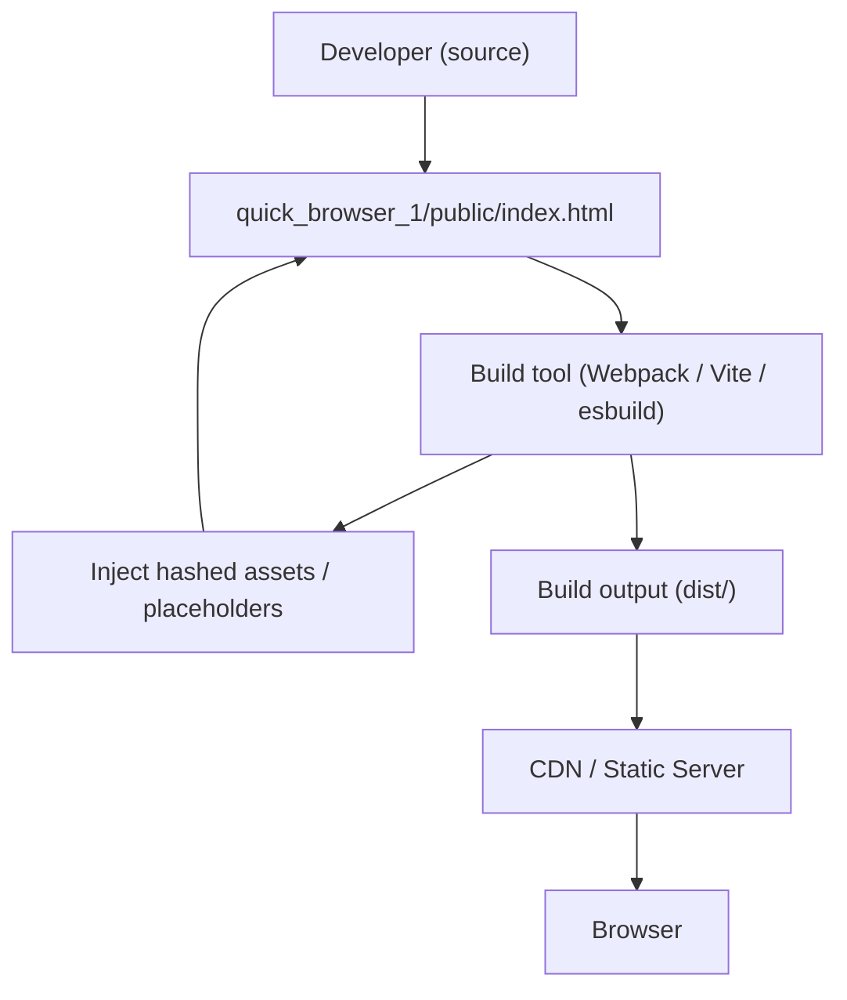

# Static HTML and asset integration

## Context: Web Frontend — static-asset / entrypoint

This subtopic documents how the public HTML entrypoint (quick_browser_1/public/index.html) functions as the host for static assets and how it integrates with build and deployment flows. Primary concerns: providing a minimal valid HTML shell, enabling build-time asset injection, supporting SPA runtime mounting, and ensuring correct behavior when served from static servers or CDNs.

## Key Abstractions

- **Static entrypoint (index.html)**  
  A minimal HTML scaffold that is served to browsers and acts as the mounting surface for client-side applications. It exposes a root element (e.g., `id="root"`) and references to compiled assets (CSS/JS) that are injected or linked during the build.

- **Build-time asset injection / templating**  
  Build tools (Webpack, Vite, Parcel, esbuild) replace placeholders or inject hashed asset filenames into the index.html during the build. This enables cache-busting and environment-specific configuration without manual edits to the HTML.

- **Static server / CDN as deployment layer**  
  Static servers and CDNs serve index.html and static assets. For SPAs, server rewrite rules typically route unknown paths to index.html (SPA fallback) so client-side routing can resolve routes.

## Collaborative Use Case

Files and tools collaborate to produce a runnable frontend and serve it reliably.

- Primary file:
  - quick_browser_1/public/index.html — public HTML entrypoint.

- Collaborators:
  - Build tool (Webpack / Vite / esbuild) — injects compiled assets, fingerprints filenames.
  - CI/CD / Deployment — publishes files to CDN or static server.
  - CDN / Static Server (Netlify, Nginx, Apache) — serves index.html and static assets; may apply caching and rewrite rules.
  - Browser runtime — requests index.html, downloads assets, and mounts the SPA.

Example index.html snippet (recommended minimal setup):

```html
<!DOCTYPE html>
<html lang="en">
<head>
  <meta charset="UTF-8" />
  <meta http-equiv="X-UA-Compatible" content="IE=edge" />
  <meta name="viewport" content="width=device-width, initial-scale=1.0" />
  <title>My App</title>
  <!-- build tool injects or replaces this with hashed filename -->
  <link rel="stylesheet" href="/assets/styles.abcdef.css">
</head>
<body>
  <div id="root"></div>
  <!-- defer prevents render-blocking; build tool injects hashed filename -->
  <script src="/assets/app.123456.js" defer></script>
</body>
</html>
```

Build-time template example (placeholder replacement):

```html
<!-- quick_browser_1/public/index.html template -->
<link rel="stylesheet" href="%CSS_BUNDLE%">
<script src="%JS_BUNDLE%" defer></script>
```

CI/build step (pseudocode):

```bash
# build step outputs assets with hashes
npm run build
# replace placeholders in index.html with generated asset names
sed -i "s|%JS_BUNDLE%|/assets/app.$JS_HASH.js|" public/index.html
sed -i "s|%CSS_BUNDLE%|/assets/styles.$CSS_HASH.css|" public/index.html
```

Server rewrite for SPA fallback (Nginx example):

```nginx
location / {
  try_files $uri $uri/ /index.html;
}
```

## Application Flow Integration

This subtopic participates in two key flows:

1. Build Process
   - Source HTML in quick_browser_1/public/index.html is used as the template or final artifact.
   - Build tool compiles JS/CSS, fingerprints assets, and injects or replaces asset references in index.html.
   - The build produces a static output directory that includes index.html and compiled assets.

2. Deployment
   - CI/CD publishes the output directory to a static host or CDN.
   - Deployment config sets cache headers and optionally sets rewrite rules for SPA routing.
   - Browser clients request index.html and referenced assets; runtime mounts the application to the DOM root and may register service workers.

Typical runtime sequence (high-level):
- Browser requests route -> CDN/Static server responds (asset or index.html).
- Browser parses index.html -> loads CSS and JS (deferred) -> JavaScript runtime mounts to `#root`.
- Optional: JavaScript registers a service worker for offline caching and asset management.

## Diagrams

### 1) File collaboration (build → deploy → runtime)



### 2) Data & control flow (request → serve → mount → service worker)

```mermaid
graph TD
  Browser["Browser"] --> Server["CDN / Static Server (serves quick_browser_1/public)"]
  Server --> C{"Is request for a static asset?"}
  C -->|Yes| Asset["Return asset (CSS / JS / image)"]
  Asset --> Browser
  C -->|No| IndexFile["Return quick_browser_1/public/index.html"]
  IndexFile --> Browser
  Browser --> Parse["Parse HTML, discover <script defer> and CSS links"]
  Parse --> FetchJS["Fetch JS bundle (e.g. /assets/app.<hash>.js)"]
  FetchJS --> JSRun["Execute JS runtime"]
  JSRun --> Mount["Mount to <div id=\"root\"> (client app)"]
  JSRun --> SWReg["Register Service Worker (optional)"]
  SWReg --> SWState{"Service Worker lifecycle"}
  SWState -->|Installed| SWActive["Activate & take control -> cache assets"]
  SWState -->|Failed| SWFail["No SW control / fallback to network"]
```

## Best Practices & Common Gotchas

- Use a root mount element (e.g., `<div id="root"></div>`) if using an SPA framework — absence prevents the app from mounting.
- Always include `<meta charset="UTF-8">` and `lang` attribute for accessibility and correct text rendering.
- Use `defer` on main script tags to avoid render-blocking:
  - `<script src="/assets/app.js" defer></script>`
- Build-time hashed filenames (content fingerprinting) are recommended to enable long-term caching:
  - e.g., `app.123abc.js`, `styles.987def.css`
- Ensure the server sets appropriate cache headers:
  - Immutable assets -> long TTL (Cache-Control: public, max-age=31536000, immutable)
  - index.html -> short TTL or no-cache so new deployments are picked up quickly
- Configure static server rewrite rules for SPA client-side routing (see Nginx example above).
- Avoid hard-coded relative asset paths that break when deploying to a subpath; use build-time base URL handling or absolute paths.
- Register service workers carefully:
  - Update SW scope and versioning on deploy to avoid serving stale bundles.
  - Prefer serving CSP and other security headers from the server rather than meta tags.

## Maintenance Checklist

- Update title and meta description for SEO and branding.
- Confirm asset links are correctly injected by the build on every release.
- Validate that index.html contains the expected mount point for the client app.
- Verify server rewrite rules and cache headers after deployment.
- Run HTML/CSS validators and automated E2E tests that exercise index.html rendering.
- Coordinate service worker changes with deployment to avoid broken clients due to cached old assets.

## Reference

- File: quick_browser_1/public/index.html — minimal HTML entrypoint; used as build target and served by static servers/CDNs.