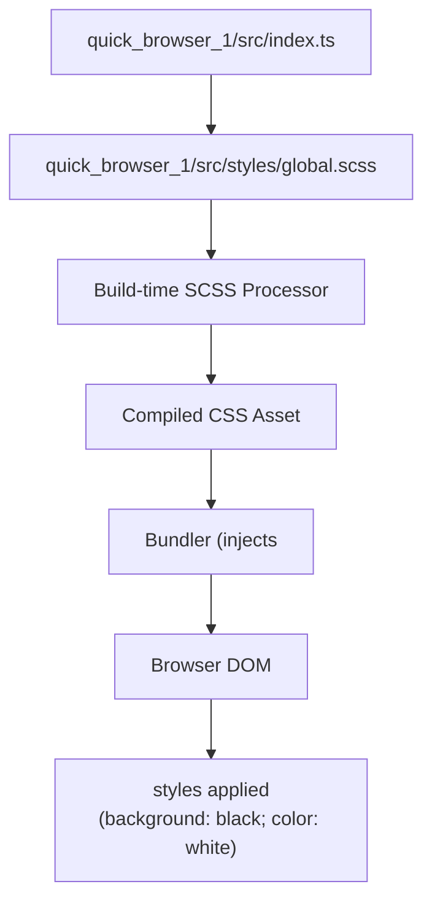
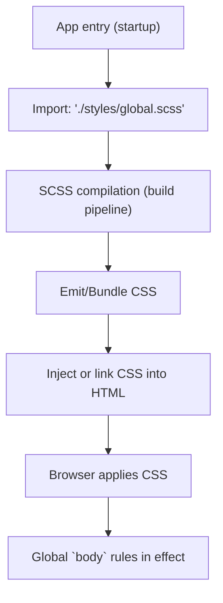

# Global styles and resets

## Summary
Provide a minimal global stylesheet authored in SCSS that establishes a baseline reset and a dark theme for the application. This stylesheet is intended to be imported at application startup so the bundler compiles and injects the resulting CSS globally (affecting the `body` element and all descendants).

Domain: UI Styling  
Relational tags: styles, presentation, theming  
Architectural layer: Presentation

## Key Abstractions
- **Global baseline (theming)** — a single global entry point for application-level visual defaults (background, foreground color). Implemented by targeting the global `body` selector to set a theme baseline for all UI.
- **Minimal reset** — a lightweight reset pattern that reduces default browser spacing by resetting `margin` and `padding` on `body` only, limiting unintended cross-component overrides.
- **Build-time style asset processing** — SCSS source files are compiled by the build pipeline into CSS and injected into the page at startup; the stylesheet contains no runtime JavaScript API.

## Files
- `quick_browser_1/src/styles/global.scss` — SCSS file containing the global reset and dark-theme defaults.
- (Consumer) `quick_browser_1/src/index.ts` — application entry typically imports `global.scss` so the bundler can include styles.

## Collaborative Use Case
Purpose: ensure the app has consistent baseline spacing and a dark theme before any components render.

How it is consumed (concrete example):
```ts
// quick_browser_1/src/index.ts
import './styles/global.scss';

// rest of app bootstrap...
```

global.scss (exact contents):
```scss
/* quick_browser_1/src/styles/global.scss */
body {
  margin: 0;
  padding: 0;
  background-color: black;
  color: white;
}
```

Consumer contract:
- Importing `global.scss` at the app entry point requires the bundler to process SCSS (e.g., via sass-loader, vite plugin, or equivalent).
- The bundler must emit or inject CSS so the rules apply globally (linked stylesheet or injected `<style>` tag).
- No runtime JavaScript interaction or exported symbols exist; the file only affects the DOM via CSS.

Dependency contract:
- No runtime JS dependencies.
- Build-time requirement: SCSS compilation to CSS.

Recommended usage patterns:
- Keep only app-wide defaults here. Avoid element-specific or highly-specific selectors.
- When the project grows, extract color and spacing tokens into a variables file or switch to CSS custom properties to enable theming and runtime overrides.

## Application Flow Integration
Primary flow enabled: *Application Startup Flow*

1. `quick_browser_1/src/index.ts` imports `quick_browser_1/src/styles/global.scss`.
2. Build system compiles SCSS → produces CSS asset.
3. Bundler injects or links the CSS into the generated HTML.
4. Browser applies CSS rules; `body` baseline resets and theme colors are in effect for all descendants.

Implications:
- Styling is applied early if the import is in the app entry point, reducing flash-of-unstyled-content for baseline styles.
- Because the file targets only `body`, component-level styles can still override or extend the theme without heavy coupling.

## Visual Diagrams

### File collaboration (imports and build-time processing)


### Application startup / control flow (style pipeline)


## Notes & Recommendations
- Keep this file intentionally minimal to reduce the risk of global specificity conflicts.
- Migrate to centralized variables (SCSS variables or CSS custom properties) when multiple theme tokens are required.
- Do not add component-level rules here; use component stylesheets for scoped styling and maintainability.