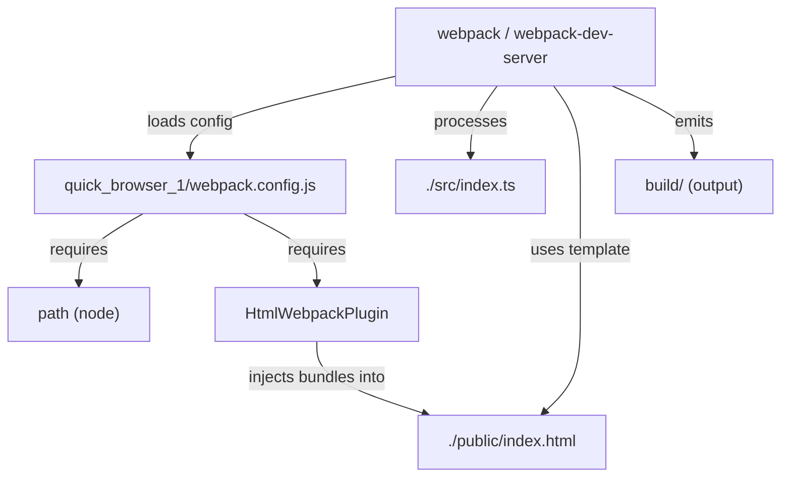
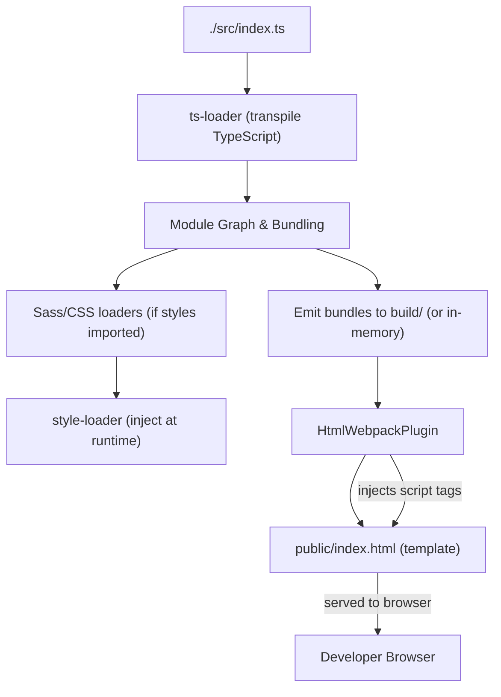

# Module bundling and loaders

## Frontend Build Tooling — Purpose & Context
Domain: Frontend Build Tooling  
Relational tags: webpack, build, frontend  
Architectural layer: Infrastructure  
Complexity: Simple

This subtopic documents how the single webpack configuration file (quick_browser_1/webpack.config.js) defines the bundling and loader pipeline used for development builds of a TypeScript frontend. It explains the configuration-level abstractions, how the file collaborates with loaders and plugins, and the key application flows it enables (Development Build Flow, Frontend Asset Bundling Pipeline, Local Dev Server Startup Flow).

## Key Abstractions
- **Configuration object**  
  The exported `module.exports` plain object is the authoritative contract webpack consumes. It declares entry/output, module rules (loaders), plugins, and resolution logic. Changing keys alters the bundling behavior.

- **Loader pipeline (chain-of-responsibility pattern)**  
  Each `module.rules` entry defines a *pipeline* of transformations applied to matched files. Loader arrays are applied right-to-left: the rightmost loader transforms raw source first, then the next, etc. Example pipelines in the config:
  - TypeScript: `ts-loader` → transpiles `.ts` to JS
  - CSS: `css-loader` (parses CSS) then `style-loader` (injects into DOM)
  - Sass: `sass-loader` → `css-loader` → `style-loader`

- **Plugin integration (extension point)**  
  Plugins receive and mutate the compilation lifecycle. `HtmlWebpackPlugin` is used to generate/inject the final bundle references into `public/index.html`. Plugins operate at a different abstraction level than loaders (build lifecycle vs per-file transformation).

## Collaborative Use Case
File: quick_browser_1/webpack.config.js  
Symbols referenced: HtmlWebpackPlugin, path

How the pieces work together (concrete examples):

- Exported config (skeleton)
```javascript
// quick_browser_1/webpack.config.js
const path = require("path");
const HtmlWebpackPlugin = require("html-webpack-plugin");

module.exports = {
  mode: "development",
  entry: "./src/index.ts",
  output: { path: path.resolve(__dirname, "build") },
  module: {
    rules: [
      { test: /\.ts?$/, use: "ts-loader", exclude: /node_modules/ },
      { test: /\.css$/i, use: ["style-loader", "css-loader"] },
      { test: /\.s[ac]ss$/i, use: ["style-loader", "css-loader", "sass-loader"] }
    ]
  },
  plugins: [ new HtmlWebpackPlugin({ template: "./public/index.html" }) ],
  resolve: { extensions: [".tsx", ".ts", ".js"] }
};
```

- How webpack consumes the config
```javascript
// webpack CLI / dev server implicitly:
const config = require("./quick_browser_1/webpack.config.js");
// webpack uses config.entry, config.module.rules, config.plugins, config.output, etc.
```

- Loader ordering example (file: src/styles/main.scss)
  - `sass-loader` compiles SCSS → CSS
  - `css-loader` resolves imports/url() and produces JS-exported CSS
  - `style-loader` injects CSS into the DOM at runtime (development)

- Plugin usage example (HtmlWebpackPlugin)  
  The `HtmlWebpackPlugin` instance referenced in the config reads `./public/index.html` and injects script/link tags for the generated bundles — no manual script tag edits required.

- Swap for production example (pattern)
```javascript
// Replace in production: style-loader -> MiniCssExtractPlugin.loader
// This extracts CSS to files instead of injecting at runtime.
```

## Application Flow Integration
Enabled flows (from flowParticipation):

1. Development Build Flow (Local dev server startup)
   - Developer runs `webpack serve` or equivalent npm script.
   - Webpack loads `quick_browser_1/webpack.config.js`.
   - Entry `./src/index.ts` is resolved and processed through configured loaders.
   - `HtmlWebpackPlugin` generates an `index.html` with injected bundle references.
   - Dev server serves built assets from memory (or emits to `build/`), and hot reloads on changes.

2. Frontend Asset Bundling Pipeline
   - Source files:
     - `.ts` → `ts-loader` → JS modules
     - `.scss`/`.sass` → `sass-loader` → `css-loader` → `style-loader`
   - Webpack performs module graph bundling and generates bundle artifacts into `build/` (or in-memory for dev server).
   - `HtmlWebpackPlugin` ensures bundles are referenced in the served HTML.

3. Local Dev Server Startup Flow
   - Config consumed by webpack-dev-server which:
     - watches source files,
     - triggers incremental rebuilds when files change,
     - injects updated assets and styles (via `style-loader`) without manual refresh when supported.

## Visual Diagrams

### File collaboration (imports / consumption)


### Data / control flow: Frontend asset bundling pipeline


## API Surface (concise)
- Export: single webpack configuration object via `module.exports`.
- Key properties in the config:
  - mode: "development" | "production"
  - entry: string | object | array (e.g., "./src/index.ts")
  - output.path: absolute path (path.resolve(...))
  - module.rules: array of loader rule objects (test, use, exclude)
  - plugins: array of plugin instances (e.g., new HtmlWebpackPlugin({...}))
  - resolve.extensions: array ([".tsx", ".ts", ".js"])

## Troubleshooting & Practical Notes
- Ensure required packages are installed and compatible: webpack, webpack-cli/webpack-dev-server, ts-loader, typescript, style-loader, css-loader, sass-loader plus a Sass implementation (`sass` or `node-sass`), html-webpack-plugin.
- Loader arrays are applied right-to-left. If styles are not applied, verify loader order and Sass runtime.
- For production builds, change `mode` to `production` and replace `style-loader` with `MiniCssExtractPlugin.loader` to extract CSS files instead of injecting them at runtime.
- Exclude `node_modules` from `ts-loader` to improve build performance; consider `transpileOnly` + `fork-ts-checker-webpack-plugin` for faster incremental builds.