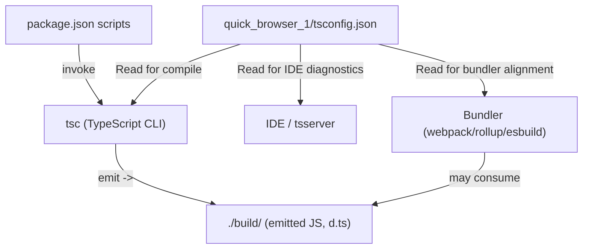
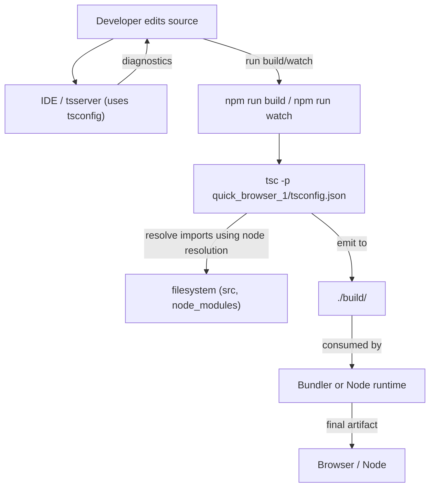

# TypeScript compilation and configuration

## Domain & Purpose
- Domain: Build & Tooling
- Relational tags: build-tooling, typescript, module-resolution
- Architectural layer: Build & Tooling

Purpose: Provide a single-source configuration for the TypeScript compiler that governs language target, module format, module resolution, JS handling, output placement, and type-checking policy. This configuration enables consistent compile-time behavior across local development, editor tooling, and build pipelines.

---

## Key Abstractions

- Configuration-as-contract
  - The tsconfig.json file is treated as a contract consumed by tsc, editors (tsserver), and bundlers. It centralizes compiler options so different tools agree on emitted JS shape, module format, and type-checking rules.

- Module/Resolution Strategy
  - Separation of *module output semantics* (`module`, `target`, `esModuleInterop`) from *module resolution semantics* (`moduleResolution`, `baseUrl`, `paths`). This ensures imports are resolved consistently and emitted code matches runtime/bundler expectations.

- Output & Emit Management
  - Explicit output control via `outDir`, `rootDir`, and `allowJs`. These options prevent emitted artifacts from being re-consumed as sources and provide a clear separation between source and build artifacts.

---

## Configuration Summary (file referenced)
File: `quick_browser_1/tsconfig.json` — acts as the authoritative compiler configuration for this project.

Active key options in this config:
- `target`: "es2016" — emitted JavaScript language level.
- `module`: "ES6" — emit ES modules.
- `moduleResolution`: "node" — Node-style import resolution.
- `allowJs`: true — include .js sources in the compilation pass.
- `outDir`: "./build/" — emit artifacts into build directory.
- `esModuleInterop`: true — runtime interop for CommonJS modules.
- `forceConsistentCasingInFileNames`: true — case-consistent imports.
- `strict`: true — enable full strictness family of checks.
- `skipLibCheck`: true — skip .d.ts checks for faster builds.

Common commented/optional flags referenced in documentation: `declaration`, `incremental`, `composite`, `declarationMap`, `sourceMap`, `checkJs`, `paths`, `baseUrl`.

---

## Collaborative Use Case

Scenario: Local development + CI build where editors, scripts, and bundlers must agree on compile output.

How the pieces collaborate (concrete examples and snippets):

1) package.json build script invoking the tsconfig
```json
{
  "scripts": {
    "build": "tsc -p quick_browser_1/tsconfig.json",
    "watch": "tsc -p quick_browser_1/tsconfig.json --watch"
  }
}
```

2) Editor (tsserver/IDE)
- The editor reads `quick_browser_1/tsconfig.json` to provide diagnostics, completions, and to apply `strict` rules. No code change required in the editor beyond opening the workspace.

3) Bundler or runtime alignment
- If a bundler expects CommonJS, either set `module: "commonjs"` in tsconfig or configure the bundler to accept ES modules output. Because current tsconfig emits ES modules (`module: "ES6"`), bundlers / runtime should be configured to accept ESM or the emitted code should be transformed.

4) Example: enabling declaration output for a published library
Add to `quick_browser_1/tsconfig.json`:
```json
{
  "compilerOptions": {
    "declaration": true,
    "declarationMap": true,
    "outDir": "./build/",
    "rootDir": "./src/"
  }
}
```
Effect: Type declarations will be generated in `./build/` and can be published alongside JS output. Ensure `types` in package.json points at generated `.d.ts`.

5) Example: incremental builds
Add:
```json
{
  "compilerOptions": {
    "incremental": true,
    "tsBuildInfoFile": "./build/.tsbuildinfo"
  }
}
```
Effect: tsc stores build metadata to speed up subsequent builds in CI or local development.

---

## Application Flow Integration

This configuration participates in the following flows:

1) Local Development (fast feedback)
- Developer edits source -> Editor (tsserver) reads `quick_browser_1/tsconfig.json` -> Type errors shown live -> `tsc --watch` uses same tsconfig to emit incremental updates to `./build/` -> Developer runs code locally against emitted JS or bundler.

2) Build Process (CI)
- CI triggers `npm run build` -> `tsc -p quick_browser_1/tsconfig.json` compiles sources to `./build/` -> Bundler/packager or Node runtime consumes artifacts -> If publishing a library, build emits `.d.ts` when `declaration` is enabled.

3) Integration with bundlers and other transpilers
- tsconfig defines the semantics of emitted modules and types. Bundler (webpack/rollup/esbuild) must be configured to accept or transform outputs consistent with `module`/`target`. If Babel is used to transpile TS, coordinate which tool strips types vs emits JS to avoid double compilation.

---

## Common Pitfalls & Recommendations

- Mismatch between emit `module`/`target` and runtime: Align Node/browser runtime or bundler settings.
- outDir inside source tree: Causes re-compilation loops. Use `rootDir` and exclude `outDir` from includes.
- `allowJs: true` without `checkJs`: JS files included but not type-checked. Set `checkJs: true` to surface JS issues.
- `esModuleInterop` interactions: Can change runtime import shapes; ensure other tools expect the emitted interop helpers.
- `skipLibCheck: true` speeds builds but may hide upstream declaration issues; consider disabling in CI for stricter validation.

---

## Visual Diagrams

### 1) File collaboration: tsconfig.json and consumers


### 2) Data/control flow: Local dev -> compile -> run


---

## Maintenance Checklist

- Keep `outDir` excluded from sources and version control.
- Align `target`/`module` with CI/runtime/bundler targets.
- Enable `declaration` and `declarationMap` before publishing libraries.
- Consider `incremental` and `tsBuildInfoFile` for faster local and CI builds.
- Re-check `skipLibCheck` policy for CI validation vs local speed.
- Add `paths` and `baseUrl` if adopting monorepo or alias imports, and configure bundler to match.

---